# DATA TYPES
***
### INTEGER

|---------------------------------------------|---------------------------------------------|
-2^31                                                                    0                                                                       2^31 - 1

- The int datatype is used for variables that will store integers
- Integers always take up **4 bytes (32 bits)** of memory. This means the range of values they can  store is neccessarily limited to 32 bits worth of information
***
### UNSIGNED INT

|---------------------------------------------|---------------------------------------------|
0                                                                        2^31                                                                   2^31 - 1

- Unsigned is a qualifier that can be applied to certain types, which effectively doubles the positive range of variables of that type, at the cost of disallowing any negative values
***
### CHAR

|---------------------------------------------|---------------------------------------------|
-128                                                                      0                                                                           127

- Ther char data type is used for variables that will store single characters
- Characters always take up **1 byte (8 bits)** in memory. This means the range of values they can store is necessarily limited to 8 bits worth of information
- Thanks to ASCII, we've developed a mapping of characters like A, B, C ... to numeric values in the positive range
***
### FLOAT

- The float data type is used for variables that will store floating point values, also known as real numbers
- Floating point values always take up **4 bytes (32 bits)** of memory
- It is complicated to describe the range of float, but suffice to say that with 32 bits of precision, some of which might be used for an integer part, we are limited in how precise we can be
***
### DOUBLE

- The double data type is used for variables that will store floating point values
- The difference is that doubles are double precision compared to floats. They always take up **8 bytes (64 bit)** in memory
- With an additional 32 bits of precision relative to float, doubles allow us to specify much more precise real numbers
***
### VOID

- Is a type, not a data type
- Functions can have a void return type, which just means they do not return a value
- printf is an example since it does not return a value, but only prints to the terminal
- The parameter list of a function can also be void. It simply means the function takes no parameters
- Think of void more as a placeholder for "nothing"
***
### BOOL

- The bool data type is used for variables that will store a boolean value. More precisely, they are capable only of storing **true or false**
- Bool is no standard data type in C, therefore one is created in cs50.h
- Sometimes when working with boolean expressions, we will use variables of type bool, but we do not have to. In C every non zero value is equivalant to true and zero to false
***
### STRING

- The string data type is used for variables that will store a series of characters
***

***

# VARIABLES
***
### CREATING VARIABLES IN C

- To bring a variable into existance in C
```c
int number;
char letter;
```
- To create multiple variables at once in C
```c
int height, width;
float sqrt2, sqrt3, pi;
```
- The different procedures to create a variable or assign a value have following names
```c
int number;                // Declaration
number = 17;               // Assignement
int number = 17;           // Initialization
```
***
### VARIABLE SCOPE

- Scope is a characteristic of a variable that defines from which functions that variable may be accessed
- For the most part local variables in C are "passed values" in function calls. The function calling this variable uses only its value to perform its function and passes the result in its own variable. So the passed variable is not altered, unless you overwrite it on purpose

**LOCAL VARIABLE**
- Can only be accessed within the function in which it was created

**GLOBAL VARIABLE**
- Can be accessed by any function in the program. To declare a global variable it has to be declared outside of a function (main() is also a function therefore declare it outside of main)
***

***

# CONDITIONALS
***
- Conditional expressions allow your programs to make decisions and take different forks in the code, depending on the values of variables or user input
- C provides a few different ways to implement conditional expressions

- When best to use what:
	- **if statements** use boolean expressions to make decisions
	- **switch statements** use discret cases to make decisions
	- **ternary statements** used to replace a very simple if else statement
***
### IF STATEMENT IN C

```c
if (boolean expression)
{
	// code;
}
else
{
	// other code;
}
```
- If the boolean expression evaluates to **true**, all lines of code between the curly braces will execute in order from top to bottom
- If the boolean expressions evaluates to **false**, these lines of code will not execute and pass to the following else statement
- In C it is possible to create an if-else-if-else chain
```c
if (boolean expression)
{
	// first branch;
}
else if (other boolean expression)
{
	// second branch;
}
else
{
	// third branch;
}
```
***
### SWITCH STATEMENT IN C

- C's switch statement is a conditional statement that permits enumeration of discrete cases, instead of relying on boolean expressions
- It is important to **break;** between each case, or you will "fall through" each case (unless that is your intended behaviour)
```c
int x = get_int();
switch (x)
{
	case 1:
		printf("One!\n");
		break;
	case 2:
		printf("Two!\n");
		break;
	default:
		printf("Sorry!\n");
}
```
- Here case 1 does not mean first case but get_int() returned the int 1
***
### TERNARY STATEMENT

- The following code snippets are identically
- The ternary operator **?:** is mostly a cute trick, but is useful for writing trivially short conditional branches.
```c
// Regular
int x;
if (boolean expression)
{
	x = 5;
}
else
{
	x = 6;
}

// Ternary Way first int if true, second if false
int x = (boolean expression) ? 5 : 6;
```
***

***

# OPERATORS
***
### ARITHMETIC OPERATORS

- In order to manipulate and work with variables and values in C, we have a number of operators at our disposal

|   ARITHMETIC   | SYMBOL |
|:--------------:|:------:|
|    Addition    |    +   |
|   Subtraction  |    -   |
| Multiplikation |    *   |
|    Division    |    /   |

- We also have the **modulus operator %** which gives us the remainder, when the number on the left of the operator is divided by the number on the right of the operator.
```c
int m = 13 % 4;
// m will be 1 because 13/4 is 3*4 = 12 and 13-12 = 1
```
- C also provides a shorthand way to apply an arithmetic operator to a single variable
```c
// regular
x = x * 5;

// shorthand
x *= 5;
```
- C provides a further shorthand for incrementing or decrementing a variable by 1
```c
x++;    // adds 1 to x
x--;    // subtracts 1 from x
```
***
### BOOLEAN LOGICAL OPERATORS

- Logical **AND (&&)** is true if and only if both operands are true, otherwise will return false

|   X   |   Y   | (x && y) |
|:-----:|:-----:|:--------:|
|  true |  true |   true   |
|  true | false |   false  |
| false | false |   false  |
| false |  true |   false  |

- Logical **OR (||)** is true if and only if at least one operand is true, otherwise false

|   X   |   Y   | (x \|\| y) |
|:-----:|:-----:|:----------:|
|  true |  true |    true    |
|  true | false |    true    |
| false | false |    false   |
| false |  true |    true    |

- Logical **NOT (!)** inverts the value of its operand

|   X   |   !X  |
|:-----:|:-----:|
|  true | false |
| false |  ture |

***
### BOOLEAN RELATIONAL OPERATORS

- These behave as you would expect them to and appear syntactically similar to how you may recall them from elementary arithmatic

|      Description      | Symbol |
|:---------------------:|:------:|
|       less than       |  x < y |
|   less than or equal  | x <= y |
|      greater than     |  x > y |
| greater than or equal | x >= y |

- C also can test two variables for equality and ineaquality

| Description | Symbol |
|:-----------:|:------:|
|   equality  | x == y |
|  inequality | x != y |

***

***

# LOOPS
***
- Loops allow your programs to execute lines of code repeatedly, saving you from needing to copy and paste or otherwise repeat lines of code
- Hint: if you start copy pasting code, either write a function or check if a loop helps
***
### INFINITE LOOP

```c
while (true)
{
	// code;
}
```
- This is what we call an infinite loop. The lines of code between the curley braces will execute repeatedly from top to bottom, forever unless we break out of it with a **break; statement** or kill the program
***
### WHILE LOOP

```c
while (boolean expression)
{
	// code;
}
```
- if the boolean expression evaluates to true, all lines of code between the curley braces will execute from top to bottom, as long as the boolean expression evaluates to true after each pass
***
### DO-WHILE LOOP

```c
do
{
	// code;
}
while (boolean expression);
```
- This loop will execute all lines of code between the curley braces at least once, and only then checks if the boolean expression is still true. If so, it will go back to the do part and execute the code. Compared to a regular while loop, this loop always executes at least once
***
### FOR LOOP

```c
for (int i = 0; i < 10; i++)
{
	// code;
}
```
- Syntactically unattractive, but for loops are used to repeat the body of a loop a specified number of times (here 10 times)
- The expression in the brakets is constructed as follows:
		for ( variable ; conditional; action / iteration)
- The process undertaken in a for loop is:
	- The counter variable(s) are set
	- The boolean expression is checked
	- The counter variable is incremented / decremented and then the boolean expression is checked again
***
### USE CASES

**WHILE LOOP**
- Use when you want a loop to repeat an unknown number of times and possibly not at all

**DO-WHILE**
- Use when you want a loop to repeat an uknown number of times, but at least once

**FOR LOOP**
- Use when you want a loop to repeat a discrete number of times, though you may not know the number at the instance the program was written
***

***
# FUNCTIONS
***
- So far all programs we have written, have been in main()
- C and nearly all languages developed since, allow us to write functions, sometimes als known as procedures, methods or subroutines
- A function is basically a black box that takes none or more input and returns one output
- The behaviour of a function is typically predictable by its name

**ORGANIZATION**
- Functions help break up complicated problems into more managable subparts

**SIMPLIFICATION**
- Smaller components tend to be easier to design

**REUSEABILITY**
- Functions can be recycled. You only need to write them once, but we can use them as often as you need
***
### FUNCTION DECLARATION

```c
int add_two_ints(int a, int b):
```
- The first step to creating a function is to declare it. This gives the compiler a heads up that a user-written function appears in the code
- Function declaration should always go atop of your code, before you begin writting main()
- There is a standard form, that every function declaration follows:
		**return-type name (argument-list);**
- The return type is what kind of variable the function will output (int, float, void, ..)
- The name should describe the function of the function
- The argument list is the comma-seperated set of inputs to your function, each with type and name
***
### FUNCTION DEFINITION

```c
int add_two_ints(int a, int b)
{
	int sum = a + b;
	return sum;
}
```
- The second step to creating a function is to define it. This allows for predictable behaviour when the function is called with inputs (arguments)
***
### FUNCTION CALLS

```c
int x = 5;
int y = 6;
int z = add_two_ints(x, y)
```
- To call a function, simply pass its appropriate arguments and assign its return value to something of the correct type (remember return type specified during function declaration)
***
### FUNCTION MISC

- Sometimes functions can take no inputs. In this case, we declare the function as having void argument list
- Sometimes functions can have no output, so we declare the function having a void return type
***

***
# COMMAND LINE ARGUMENTS
***

- So far all of our programs started with
```c
int main(void)
{
	// code;
}
```
- Since we have been collecting user input through in-program prompts and not from outside of the program
- To collect so called command line arguments from the user, we have to declare main as follows
```c
int main(int argc, string argv[])
{
	// code;
}
```
- These two special arguments enable you to know what data the user provided at the command line and how much data they provided
***
### ARGUMENT COUNT argc

- This integer-type variable will store the number of command line arguments the user typed when the program was executed

|  **COMMAND LINE**  | **argc** |
|:------------------:|:--------:|
|      ./program     |     1    |
| ./program 1024 C4Z |     3    |

**NOTE**
- The program name itself is counted as well!
***
### ARGUMENT VECTOR argv

- This array of strings, stores one string per element, the actual text the user typed into the command line, when the program was executed
- The first element at argv is always found at argv[0] and is the program name

| **./program 1024 C4Z** |   **argv**  |
|:----------------------:|:-----------:|
|         argv[0]        | "./program" |
|         argv[1]        |    "1024"   |
|         argv[2]        |    "C4Z"    |


***

***

# ARRAYS
***
- Arrays are fundamental data structures. We use arrays to hold **values of the same type**(string, int, char ...) at contigous memory locations
- You can access each element of an array, which can only hold a certain amount of elements, by index number
- In C, the elements of an array are indexed starting from index 0. This is one of the major reasons we count from 0 and not 1 in C
- If an array consists of n elements, the first is located at index 0. The last element at index(n-1)
***
### ARRAY DECLARATION

```c
type name[size]
```
- The type is what kind of variable at each element at the array will be
- The name is what you want the array to be called
- The size is how many elements you would like your array to contain
- If you think of a single element of an array of type data type, the same as you would any other variable of type data type, then all the familiar operations make sense
```c
bool truthable[10];
truthable[2] = false;
if (truthable[7] == true)
{
	printf("True!\n");
}
```
**CAUTION** 
- in the upper example you have 10 elements in the array, that means index 0 - (n-1) which means last index is 9. If you accessed truthable[10] you would be out of scope and find "\0" which defines the end of an array in memory

- When declaring and initializing an array simultanously, there is a special syntax that me be used to fill up the array with its starting values

**INSTANTIATION SYNTAX**
```c
bool truthable[3] = {false, true, true};
```

**INDIVIDUAL ELEMENT SYNTAX**
```c
bool truthable[3];
truthable[0] = false;
truthable[1] = true;
truthable[2] = true;
```

- You can leave the array size empty at instantiation and the compiler will figure out its size, depending on its elements
- Arrays can consist of more than a single dimension. You can have as many size specifiers as you wish.
```c
bool battleship[10][10];
```
- You can think of this as a 10 x 10 grid of cells. In memory it really just is a 100 element one-dimensional array
```c
// array bool battleship[10][10]

|-|-|-|-|-|-|-|-|-|-|
|-|-|-|-|-|-|-|-|-|-|
|-|-|-|-|-|-|-|-|-|-|
|-|-|-|-|-|-|-|-|-|-|
|-|-|-|-|-|-|-|-|-|-|
|-|-|-|-|-|-|-|-|-|-|
|-|-|-|-|-|-|-|-|-|-|
|-|-|-|-|-|-|-|-|-|-|
|-|-|-|-|-|-|-|-|-|-|
|-|-|-|-|-|-|-|-|-|-|
```
- While we can treat individual elements of an array as variables, we cannot treat the entire arrays themselves as variables. We cannot assigne one array to another using =. Instead we must use a loop to copy each element over, one at a time
- Recall that most variables in C are "passed by value" in function calls. Arrays do not follow this rule. They are "passed by reference". The callee recieves the actual array, not a copy of the array
***

***

# LINEAR SEARCH
***
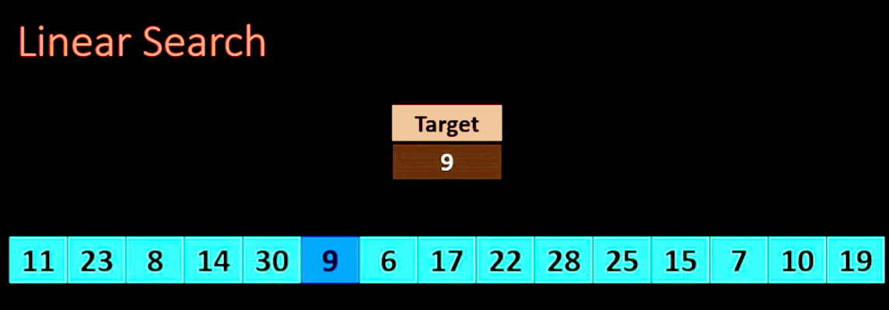
- In linear search, the ide of the algorithm is to iterate across the array from left to right, searching for a specified element
```c
// pseudo code
//
// Repeat, starting at the first element
//    If the first element is what you're looking for (target)
//        quit
//    Otherwise, move to the next element
```

**WORST CASE SCENARIO - O(n)**
We have to look through the entire array of n elements, either because the target element is the last element of the array or does not exist in the array at all

**BEST CASE SCENARIO - Ω(1)**
The target element is the first element of the array and so we can stop looking immediately after we start
***

***
# BINARY SEARCH


- In binary search, the idea of the algorithm is to divide and conquer, reducing the search area by half each time, trying to find a target number
- In order to leverage this power however, **our array must first be sorted**, else we cannot make assumptions about the array's contents
```c
// pseudo code
//
// Repeat until (sub)array is of size 0
//   Calculate the middle point of the current (sub)array
//   If target is at the middle
//      quit
//   Otherwise if target is less than middle, repeat changing the end point of   //      new array to be just to the left of the middle 
//   Otherwise if target is greater than middle, repeat changing the start point 
//      of new array to be just to the left of the middle 
```

**WORST CASE SCENARIO - O(log n)**
We have to divide a list of n elements in half repeatedly to find the target element, either because the target element will be found at the end of the last division or does not exist in the array at all

**BEST CASE SCENARIO - Ω(1)**
The target element is at the midpoint of the full array and so we can stop looking immediately after we start
***

***
# BUBBLE SORT
***
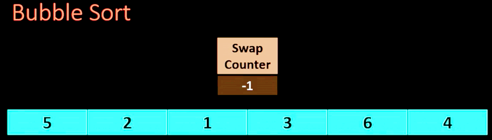
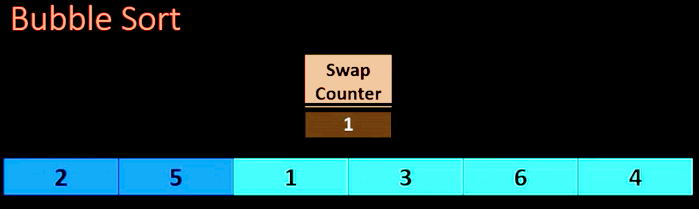
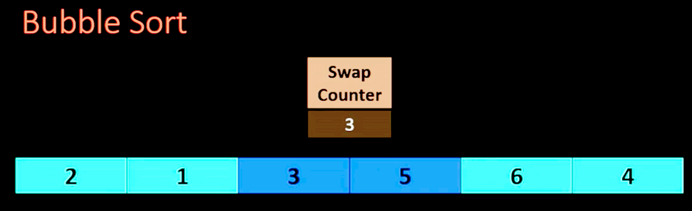

- In bubble sort, the idea of the algorithm is to move higher valued elements generally towards the right and lower value elements generally towards the left
```c
// pseudo code
//
// Set swap counter to a non-zero value
// Repeat until swap counter is 0
//   Reset swap counter to 0
//   Look at each adjacent pair
//      If two adjacent elements not in order, swap them and swap counter++
```
- The algorithm will pass over the array and swap out of order elements with each other. For every swap the counter is incremented by 1 and therefore not 0 once we reach the end of the array. Once all elements are sorted, the will be no swap and therefore the counter will be 0 at the end of the arry. Now the counter is 0 the array can be assumed sorted and the algorithm stops

**WORST CASE SCENARIO - O(n^2)**
The array is in reverse order, we have to "bubble" each of the n elements all the way across the array and since we can only fully bubble one element into position per pass, we must do this n times

**BEST CASE SCENARIO - Ω(n)**
The array is already perfectly sorted and we make no swaps on the first pass
***

***
# SELECTION SORT
***
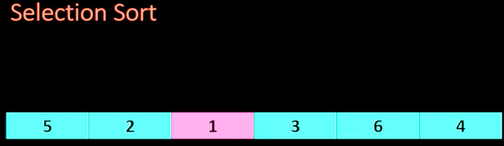
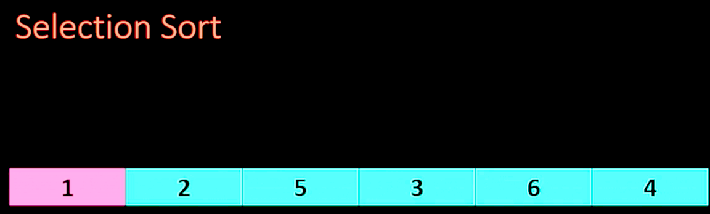
- Above the smallest next number is 2, this is already at the **first unsorted position** of the array. so we contine. Unsorted array start index will increase for every found number
- In selection sort, the idea of the algorithm is to find the smallest unsorted element and add it to the end of the sorted list
```c
// pseudo code
//
// Repeat until no unsorted elements remain
//   Search the unsorted part of the data to find smallest value
//      Swap smallest found value with first element of unsorted part
```

**WORST CASE SCENARIO - O(n^2)**
We have to iterate over each of the n elements of the array (to find the smallest unsorted element) and we must repeat this process n times, since only one element gets sorted on each pass

**BEST CASE SCENARIO - Ω(n^2)**
Exactly the same! There is no way to gurantee the array is sorted until we go through this process for all the elements in the array
***

***
# MERGE SORT
***
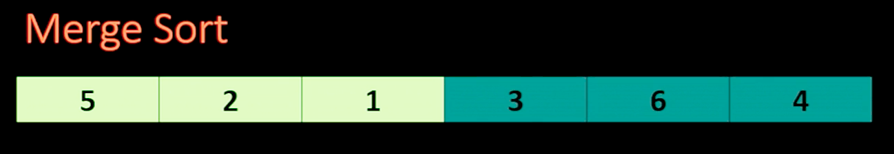
- First we will sort the left half of the array. Since we don't yet know how to sort this array of now 3 numbers, we go back to our code and have it sort the half of the now half array
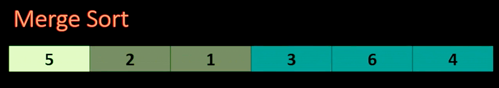
- Since we can not divide 3 by 2 to get even halfs, we follow the rule that **that the left half has to always be smaller than the right half, if it is not even**. No we are left with only a single element and that is to be considered sorted already
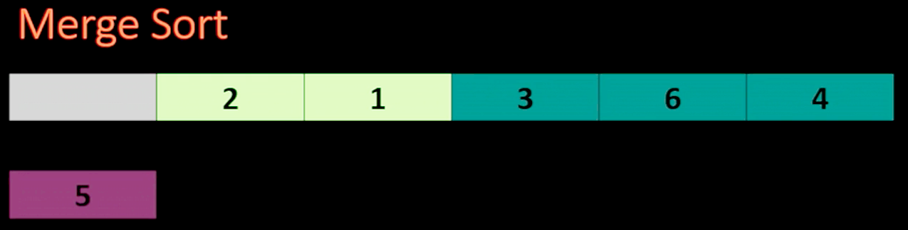
- No that 5 is sorted, we go to the other half which is now 2 and 1. So we go back to our code and divide the array of 2, 1 into an array with only one element which will be 2. Since it is a single element we again can assume this to be sorted. That leaves us with an array with only the element 1, which again is sorted.
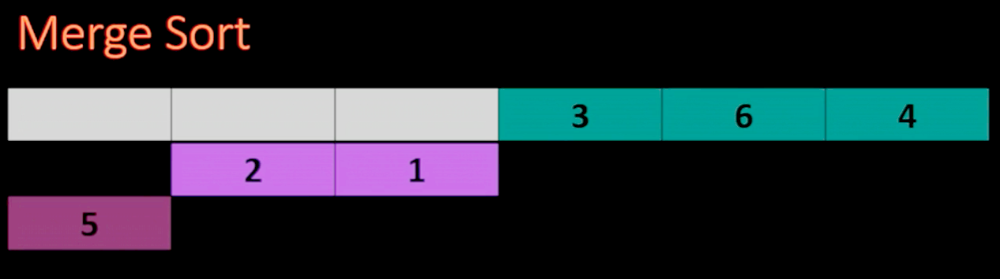
- No we come to the merge part of our code. Now we have to first consider these light purple halfes and we have to decide which one has the lower element. Between 2 and 1, 1 is the lower element. So we take the 1 and put it into the first position of another subarray.
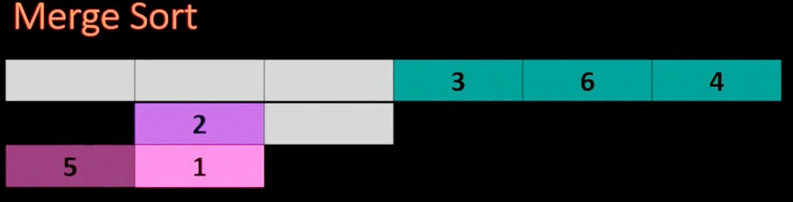
- This leaves us with the array in which 2 is and since it is a single element, there is nothing to compare it against, if it is the lowest element or not. So we just add it to our subarray.
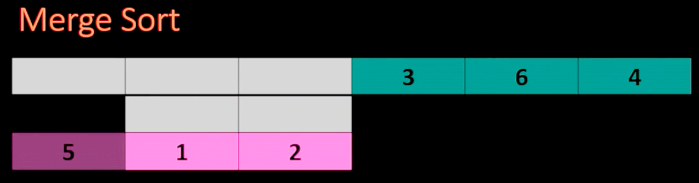
- No we are no longer thinking of the purple area as halfs, but again as an array with 5, 1, 2 in it. So now we look at the first element of the left part of this array and compare it against the first part of the second array, to see which is lower and then transfer that to a new subarray. Here I compare 5 against 1. 1 is of course the lower element, so we take one an add it as first element to our subarray.
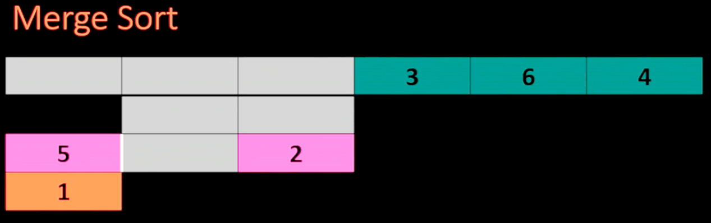
- No we compare again first element of the left array to the first element of the right array. Here 5 against 2. 2 is lower, so we add 2 to our subarray
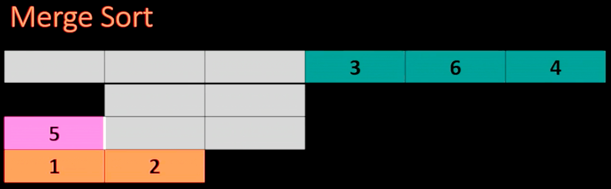
- Now there is only 5, which can not be compared to another element, so we just transfer it to the subarray.
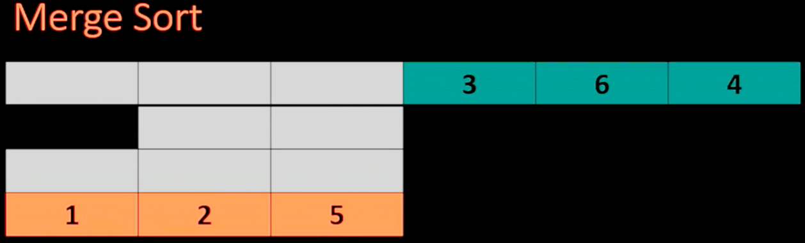
- At this point, let us think recursively were we are. We have sorted the left portion of the original array recursively. Now we will the the exact same with the right part of the original array and end up with this
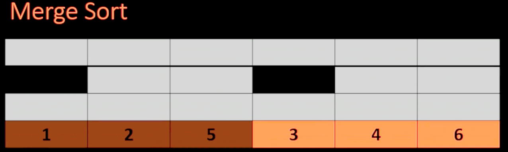
- Now we have sorted the left and right half of the original array. Next step is to merge these to sorted arrays together. So now we compare the first element of the left have, against the first element of the right half against each other. Here this would be 1 and 3. 1 is lower, so 1 gets added to the new array.
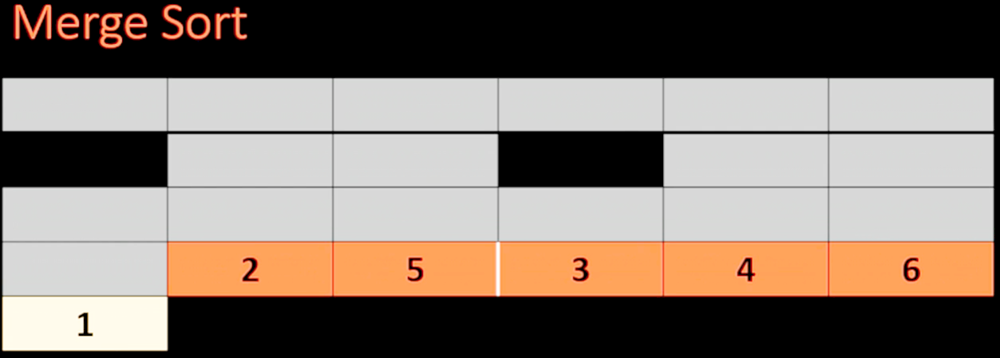
- No we contine to compare the first element of the left half, aginst the first element of the second half. Here 2 and 3. 2 is lower ..... we continue this until there is either nothing left on one side, which causes the other side to be just added to the new array, or we compared all elements and end up with a sorted array.
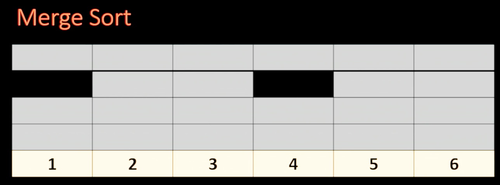

- In merge sort, the idea of the algorithm is to sort smaller arrays and then combine those subarrays together (merge them) in sorted order
- Merge sort leverages something called recursion
```c
// pseudo code
//
// Sort left half of the array (assuming n > 1)
// Sort right half of the array (assuming n > 1)
// Merge the two halves together
```

**WORST CASE SCENARIO - O(n log n)**
We have to split n elements up and then recombine them, effectively doubling the sorted subarrays as we build them up (combining sorted 1-element arrays into 2-element arrays, combining sorted 2-element arrays into 4-element arrays ...)

**BEST CASE SCENARIO - Ω(n log n)**
The array is already perfectly sorted. But we still have to split and recombine it back together with this algorithm

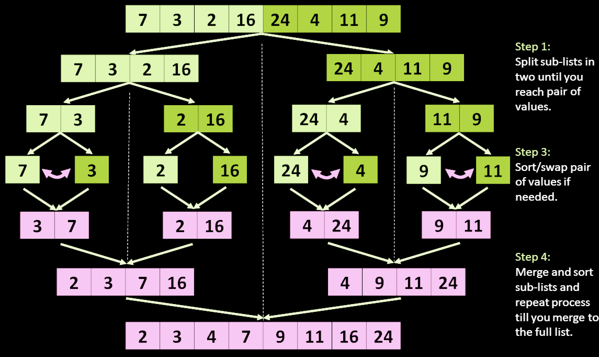
***

***
# RECURSION
***

- We might describe an implementation of an algorithm as being particularly "elegant" if it solves a problem in a way that is both interesting and easy to visualize
- The technique of **recursion** is a very common way to implement such an "elegant" solution
- The definition of a recursive function is one that, as part of its execution, invokes itself

**EXAMPLE**
- The factorial function (n!) is defined over all positive integers
- n! equals all of the positive integers less than or equal to n, multiplied together
- Thinking in terms of programming, we'll define the mathematical function n! as fact(n)
```c
// example of factorial
fact(1) = 1
fact(2) = 2 * 1
fact(3) = 3 * 2 * 1
fact(4) = 4 * 3 * 2 * 1

// expressing factorial in terms of factorial
fact(1) = 1
fact(2) = 2 * fact(1)
fact(3) = 3 * fact(2)
fact(4) = 4 * fact(3)

// definition of factorial for any number in code would be
fact(n) = n * fact(n-1)
```
- This forms the basis for a **recursive definition** of the factorial function
- Every recursive function has two cases that could apply, given any input
	- The **base case**, which when triggered will terminate the recursive process
	- The **recursive case**, which is where the recursion will actually occur

```c
// implementing factorial into a recursive function

int fact(int n)
{
	// base case
	if (n == 1)
	{
		return 1;
	}

	// recursive case
	else
	{
		return n * fact(n-1);
	}
}
```
- Whenever you have a single line loops or single line conditional branches you can leave the curley braces out
```c
int fact(int n)
{
	// base case
	if (n == 1)
		return 1;
	// recursive case
	else
		return n * fact(n-1);

}
```
- So with this function, if we set n = 5 we see that it will pass the base case, go to the else statement. There we have: 5 * fact(5-1). So now n will equal 4 .... Once n = 1 we hit the base case and will no longer go to the recursive function but return 1 from the base case and all previous fact(n) will have their input to solve their fact()

- In general, but not always, recursive functions replace loops in non-recursive functions
```c
// the iterative way of the recursive code above would look like this

int fact(int n)
{
	int product = 1;
	while (n > 0)
	{
		product *= n;
		n--;
	}
	return product;
}
```
- It is possible to have more than one base case or recursive case, if the program might recurse or terminate in different ways, depending on the input being passed in

- **Multiple base case example**: The Fibonacci number sequence is defined as follows
	- The first element is 0
	- The second element is 1
	- The n-th element is the sum of the (n-1)th and (n-2)th elements

- **Multiple recursive cases example**: The Collatz conjecture
	- The Collatz conjecture applies to positve integers and speculates that it is always possible to get "back to 1" if you follow these steps:
		- If n = 1, stop
		- Otherwise, if n is even, repeat this process on n/2
		- Otherwise, if n is odd, repeat this process on 3n + 1
```c
#include <stdio.h>

int collatz(int n);

int main(void)
{
	int result = collatz(3);

	printf("%i\n", result);

}

int collatz(int n)
{

	// base case
	if (n == 1)
	{
		return 1;
	}

	// recursive case for even number
	else if ((n % 2) == 0)
	{
		return 1 + collatz(n / 2);
	}
	// recursive case for odd number
	else
	{
		return 1 + collatz(3*n + 1);
	}
}
```
- The 1 added to the collatz is because we count the steps! Therefore we have to count the steps (+1) for every iteration
***

***
# HEXADECIMAL
***
- Most western cultures use the deciaml system, aka **base-10**, to represent numeric data
		**0 1 2 3 4 5 6 7 8 9** 
- As we know, computers use the binary system, aka **base-2**, to represent numeric (and indeed all data)
		**0 1**
- As computer scientists, it's useful to be able to express data the same way the computer does
- The problem, of course, is that trying to parse a huge chain of 0s and 1s can be quite difficult
- The hexadecimal system, aka **base-16**, is a much more concise way to express the data on a computer
		**0 1 2 3 4 5 6 7 8 9 a b c d e f**
- Hexadecimal makes this mapping easy because a group of **four binary digits (bits)** is able to have 16 different combinations and each of those combinations maps to a single hexadecimal digit
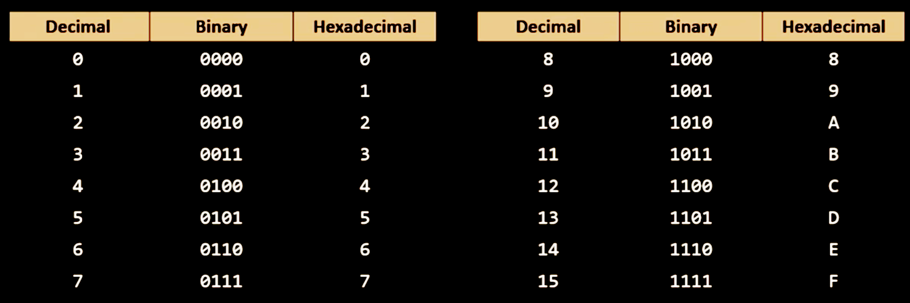
- To make it easy for humans to distinguish between the lower numbers in decimal and hexadecimal, hexadecimal numbers are usually written with a preceeding 0x
	- Decimal 4 is Hexadecimal 0x4
	- Decimal 7 is Hexadecimal 0x7
	- Decimal 12 is Hexadecimal 0xC
- Just like binary has place values (1, 2, 4, 8 ...th place[powers of 2]) and decimal does to (1, 10, 100, 1000...th place[powers of 10]), so does hexadecimal with (1, 16, 256, 4096....th place[power of 16])
	- 397 in decimal is 3x100 + 9x10 + 1x7 = 397
	- 0x397 in hexadecimal is 3x256 + 9x16 + 1x7 = 919
- To convert a binary number to a hexadecimal, group four binary digits (bits) together from right to left. Add a 0 in front of the leftmost binary group if it only gives 3 digits
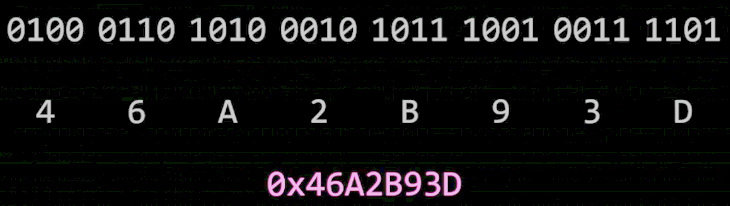
- Remember hexadecimal is not primarily used to perform calculations, we mostly use it for memory adresses 
***

***
# POINTERS
***
- Pointers provide an alternative way to pass data between functions. Recall that up to this point, we have passed all data **by value** with one exception. When we pass data by value, we only pass a copy of that data (variable scope)
- If we use pointers instead, we have the power to pass the actual variable itself. That means that a change that is made in one function **can** impact what happens in a different function
- Before we dive into what pointers are and how to work with them, it's worth going back to basics and have a look at our computers memory
- Every file on your computer lives on your disk drive, be it a HDD or SSD
- Disk drives are just storage space, we can't directly work there. Manipulation and use of data can only take place in RAM, so we have to move the data there
- Memory is basically a huge array of 8-bit wide bytes
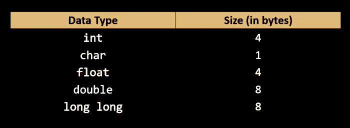
- Back to this idea of memory as a big array of byte-sized cells. Recall from our discussion of array, that they not only are useful for storage of information but also for so-called **random access**. We can access individual elements of the array by indicating which index location we want. Similarly each location in memory has an adress
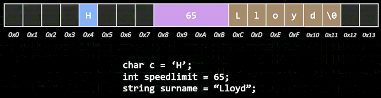
- There's only one critical thing to remember as we start working with pointers
		**POINTERS ARE JUST ADDRESSES**
- Pointers are adresses to memory, where variables live
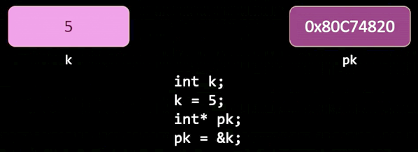
- We can think of the picture above to get a better understanding of what a pointer is. We have the box k, which we declared can only hold integers. We then put the integer 5 in the box k. Then we create a pointer box pk, that only holds adresses of ints. We then give this pointer box the adress of (&) our integer k
- A pointer is a data item:
	- whose value is a memory address (&k)
	- type describes the data located at that memory address (int* pk)
- As such, pointers allow data structures and / or variables to be shared among functions
- The simplest pointer availabe to use in C is the NULL pointer. As you might expect , this pointer points to nothing (a fact which can actually come in handy!)
- When you create a pointer and you don't set its value immediately, you should **always** set the value of the pointer to NULL
- You can check whether a pointer is NULL using the equality operator ( == )
- Another easy way to create a pointer is to simply extract the address of an already existing variable. We can do this with the "address of"-operator ( & )
- If x is an int-type variable, then &x is a pointer-to-int whose value is the adress of x
- If arr is an array of doubles, then &arr[i] is a pointer-to-double whose value is the address of the ith element of arr. 
- An arrays name, then, is actually a pointer to its first element. That is why we can change an array within a function and this change will reflect outside of this function as well!
- The main purpose of a pointer is to allow us to modify or inspect the location to which it points. We do this by **dereferencing** the pointer
- If we have a pointer-to-char called pc, then * pc is the data that lives at the memory address stored inside the variable pc
- Used in this context * is known as the **dereference operator**. It "goes to the reference" and accesses the data at that memory location, allowing you to manipulate it at will. This is just like visiting your neighbour. having their address isn't enough. You need to **go to** the address and only then can you interact with them
- When you dereference a pointer whose value is NULL you get a **segmentation fault**. Surprisingly this is actually good behaviour. It defends against accidental dangerous manipulation of unknown pointers. That is why we recommend you set your pointers to NULL immediately, if you aren't setting them to a known, desired value
```c
int* p;
```
- The value of p is an address. We can dereference p with the * operator. If we do, what we'll find at that location is an int
- One more annoying thing with those * s. They're an important part of both the type name and the variable name
```c
int* px, py, pz;    // creates pointer px and to int variables py and pz
int* pa, *pb, *pc;  // creates three pointer pa, pb and pc
```
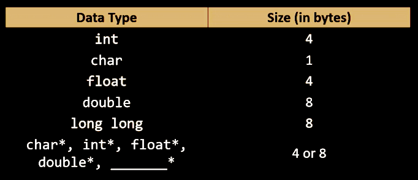
- depending on your system pointer are either 4 or 8 bytes. 4 bytes for 32bit systems and 8 bytes for 64bit systems
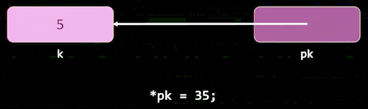
- Here a small example, what does this do?
	- We dereference, go to the address pointed to by pk and we change what we find. So the integer 5 is changed to 35
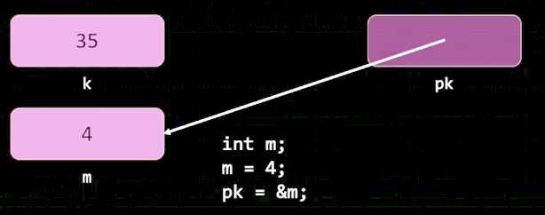

***

***
# DEFINING CUSTOM TYPES
***

- The C keyword typedef provides a way to create a shorthand or rewritten name for data types
- The basic idea is to first define a type in the normal way, then alias it to something else
```c
typedef <old name> <new name>;

// in cs50.h string was defined this way

typedef char* string;
```

```c
struct car
{
	int year;
	char model[10];
	char plate[7];
	int odometer;
	double engine_size;
}

// To no have to call struct car for every car, we can call it car_t

typedef struct car car_t;

// or you can even create a shorter name from the start

typedef struct car
{
	int year;
	char model[10];
	char plate[7];
	int odometer;
	double engine_size;
}
car_t;

// variable declaration with old method
struct car mycar;

// variable declaration with new method
car_t mycar;

// field accessing
mycar.year = 2011;
mycar.plate = "CS50";
mycar.odometer = 50505;
```
***

***
# DYNAMIC MEMORY ALLOCATION
***

- We can use pointers to get access to a block of **dynamically-allocated memory** at runtime
- Dynamically allocated memory comes from a pool of memory known as the heap
- Prior to this point, all memory we've been working with has been coming from a pool of memory known as **stack**
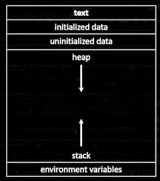
- We get this dynamically-allocated memory by making a call to the C standard library function **malloc()**, passing as its parameter, the number of bytes requested
- After obtaining memory for you (if it can), malloc() will return a pointer to that memory location
- If malloc() **can't** give you memory, it will return NULL
```c
// statically obtain an integer
int x;

// dynamically obtain an integer
int *px = malloc(sizeof(int));

// get an integer from the user
int x = GetInt();

// array of floats on the stack
float stack_array[x];

// array of floats on the heap
float* heap_array = malloc(x * sizeof(float));
```
- Here is the trouble: Dynamically allocated memory is not automatically returned to the system for later use, when the function in which it was created, finishes execution
- Failing to return memory back to the system when you're finished with its results is a **memory leak** which can compromise your system's performance
- When you finish working with dynamically-allocated memory, you must **free()** the memory
```c
// allocate memory for a 50 character array called word
char* word = malloc(50 * sizeof(char));

// work with the array word

// when you are done with working with the array
free(word);
```
- **THREE GOLDEN RULES:**
	1. Every block of memory that you malloc() must subsequently be free()
	2. Only memory that you malloc() should be free()
	3. Do not free() a block of memory more than once
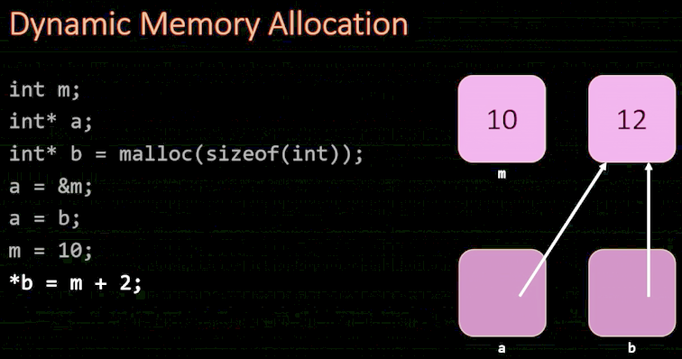
- int m; creates an integer variable m that can store an integer value
- int* a; creates a pointer variable that can hold an address to an integer
- int* b = ... creates a memory space of 4 bytes on the heap that can hold an integer and b points to that memory location
- a = &m; stores the memory address of m in pointer a
- a = b; now the memory location in b is stored in a aswell, so pointer a points to the memory address that was stored in pointer b
- m = 10; stores the integer value 10 in the variable m
- * b = m + 2; gives us 10 + 2 = 12 and that is stored in memory location, that pointer b points to
***

***
# CALL STACKS
***
- When you call a function, the system sets aside space in memory for that function to do its necessary work. We frequently call such chunks of memory **stack frames** or **function frames**
- More than one function's stack frame may exist in memory at a given time. If main() calls move(), which then calls direction(), all three functions have open frames but **ony one function will be active at a time**
- These frames are arranged in a **stack**. The frame for most recently called function is always on the top of the stack
- When a new function is called, a new frrame is **pushed** onto the top of the stack and becomes the active frame
- When a function finishes its work, its frame is **popped** off of the stack and the frame immediately below it becomes the new active function on the top of the stack. This function picks up immediately where it left off
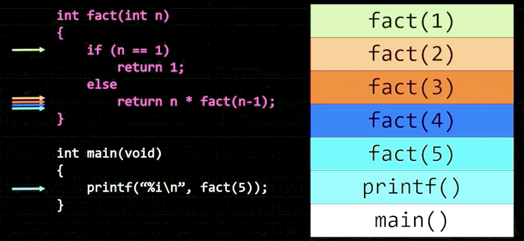
- main calls the print function, which in return calls the fact() function with the argument 5
- fact() checks if the passed argument is equal to 1, if not then it return 5 * fact(5-1) which is basically calling fact(4) and so on
- Once the argument reaches 1 and fact(1) is called, it returns 1
- Now the stack pops off the active fact(1) and passes 1 to fact(2)
- fact(2) gets 1 returned from fact(1) which gives 2 x 1 = 2
- fact(3) gets 2 returned from fact(2) which gives 3 x 2 = 6
- fact(4) gets 6 returned from fact(3) which gives 4 x 6 = 24
- fact(5) gets 24 returned from fact(4) which gives 5 x 24 = 120
- then 120 is passed to the print function, which then prints 120
- Printf finished so main is the active frame
***

***
# FILE POINTERS
***

- The ability to read data from and write date to files is the primary means of storing **persistant data**, data that does not disappear when your program stops running
- The abstraction of files that C provides is implemented in a data structure known as a **FILE**. Almost universally when working with files, we will be using pointers to them like FILE*.
- The file manipulation functions all live in stdio.h. All of them accept FILE* as one of their parameters, except for the function **fopen()**, which is used to get a file pointer in the first place
- Some of the most common file input/ouput (I/O) functions that we'll be working with are:
	- fopen()
	- fclose()
	- fgetc()
	- fputc()
	- fread()
	- fwrite()

### **fopen()**
- opens a file and returns a file pointer to it
- always check the return value to make sure you don't get back NULL
```c
FILE* ptr = fopen(<filename>, <operation>);

// example
FILE* ptr1 = fopen("file1.txt", "r");
```
- "r" allows us to read the content of file1.txt
- "w" allows us to write information to file1.txt, if the opened file already contains data, this data will be lost and overwritten with the new written data
- "a" allows us to append data to file1.txt and add it to the existing data, nothing will be overwritten

### **fclose()**
- closes the file pointed to by the given file pointer
```c
fclose(<file pointer>);

//example
fclose(ptr1);
```

### **fgetc()**
- Reads and returns the next character from the file pointed to
- Note: The operation of the file pointer passed in as a parameter must be "r" for read or you will suffer an error
```c
char ch = fgetc(<file pointer>);

// example
char ch = fgetc(ptr1);
```
- The ability to get a single character from files, if wrapped in a loop, means we could read all the characters from file and print them to the screen, one-by-one essentially:
```c
char ch;
while((ch = fgetc(ptr)) != EOF)
	printf("%c", ch);
```
- We might put this in a file called cat.c, after the Linux command "cat" which essentially does just this
- EOF is defined in stdio.h and is the END OF FILE character

### **fputc()**
- Writes or appends the specified character to the pointed-to file
- Note: The operation of the file pointer passed in as parameter must be "w" for write or "a" for append, or you will suffer an error
```c
fputc(<character>, <file pointer>);

// example
fputc('A', ptr2;
```
- No we can read characters from files and write characters to them. Let's extend our previous example to copy one file to another, instead of printing to the screen
```c
char ch;
while((ch = fgetc(ptr)) != EOF)
	fputc(ch, ptr2);
```
- We might put this in a file called cp.c, after the linux command "cp" which essentially does this job

### **fread()**
- Reads "qty" units of size "size" from the file pointed to and stores them in memory in a buffer (usually an array) pointed to by "buffer"
- Note: The operation of the file pointer passed in as a parameters must be "r" for read, or you will suffer an error
```c
fread(<buffer>, <size>, <qty>, <file pointer>);

// example for int array 
int arr[10];
fread(arr, sizeof(int), 10, ptr);

// example with use of malloc
int* arr = malloc(sizeof(int) *10);
fread(arr, sizeof(int), 10, ptr);

// example to store just one character similiar to fgetc()
char c;
fread(&c, sizeof(char), 1, ptr);
```
- The command looks a bit complex but in essence it is similar to fgetc() but allows us to get more than just one character at a time:
	- buffer is the pointer to the location, where we are going to store the information
	- size is the parameter of how large each unit of information will be
	- qty is how many units of information we want to aquire
	- file pointer is where we get this information from
- Note that for arrays we can just use the name of the array as buffer, because an array is just a pointer, pointing to the address of its first item. But to point to a variable (here the example char c), we have to use the "address of" operator & with the variable name

### **fwrite()**
- Writes "qty" units of size "size" to the file pointed to by reading them from a buffer (usually an array) pointed to by "buffer"
- Note: The operation of the file pointer passed in as parameter must be "w" for write or "a" for append, or you will suffer an error
```c
fwrite(<buffer>, <size>, <qty>, <file pointer>);

// example with array
int arr[10];
fwrite(arr, sizeof(int), 10, ptr);

// example using malloc
int* arr = malloc(sizeof(int) * 10);
fwrite(arr, sizeof(int), 10, ptr);

// example storing a single character
char c;
fwrite(&c, sizeof(char), 1, ptr);
```

- There are other useful functions in stdio.h for you to work with as well. A list of examples are:
	- fgets() reads a full string from a file
	- fputs() writes a full string to a file
	- fprintf() writes a formatted string to a file
	- fseek() allows you to rewind or fast-forward within a file
	- ftell() tells you at what byte position you are within a file
	- feof() tells yoi whether you've read to the end of a file
	- ferror() indicates whether an error has occured in working with a file
***

***
# DATA STRUCTURES
***
- By this point we've now examined four different ways to store sets of data:
		- Arrays
		- Linked Lists
		- Hash Tables
		- Tries
- There are even some variations on these (trees and heaps, quite similar to tries, stacks and queues quite similar to arrays or linked lists, etc). but this will generally cover most of what we're looking at in C

## Arrays
```c
int truthable[3];
truthable[0] = 1;
truthable[1] = 5;
truthable[2] = 3;
```
- Insertion is bad - lots of shifting to fit an element in the middle
- Deletion is bad - lots of shifting after removing an element
- Lookup is great - random access, constant time
- Relatively easy to sort
- Relatively small size-wise
- Stuck with a fixed size, no flexibility

## Linked Lists


- Insertion is easy - just tack onto the front
- Deletion is easy - once you find the element
- Lookup is bad - have to rely on linear search
- Relatively difficult to sort - unless you're willing to compromise on super fast insertion and instead sort as you construct
- Relatively small size-wise (not as small as arrays though)

## Hash Tables


- Insertion is a two-step process - hash, then add
- Deletion is easy - once you find the element
- Lookup is on average better than with linked lists, because you have the benefit of a real-world constant factor
- Not an ideal data structure if sorting is the goal - just use an array
- Can run the gamut of size

## Tries


- Insertion is complex - alot of dynamic memory allocation, but gets easier as you go
- Deletion is easy - just free a node
- Lookup is fast - not quite as fast as an array, but almost
- Already sorted - sorts as you build in almost all situations
- Rapidly becomes huge, even with very little data present, not great if space is at a premium
***

***
# STRUCTURES
***
- Structures provide a way to unify several variables of different types into a single, new variable type which can be assigned its own type name
- We use structures (structs) to group together elements of a variety of data types that have a logical connection (nodes for example)
- Think of structures as "super-variables"
```c
struct car
{
	int year;
	char model[10];
	char plate[7];
	int odometer;
	double engine_size;
};
```
- Once we have defined a structure, which we typically do in a seperate .h file or atop our programms outside of any functions, we have effectively created a new type
- That means we can create variables of that type using the familiar syntax
- We can also access the various fields (also known as members) of the structure, using the dot operator
```c
// variable declaration
struct car mycar;

// field accessing
mycar.year = 2011;
strcpy(mycar.plate, "CS50");
mycar.odometer = 50505;
```
- Here you can see we use strcpy to assign a string to mycar.plate. Remember we can not assigne a string to a variable, we have to copy it into the variable
- Structures, like variables of all other data types, do not need to be created on the stack. We can dynamically allocate structures at run time if our programm requires it
- In order to access the fields of our structures in that situation, we first need to dereference the pointer to the structure and then we can access its field


```c
// variable declaration
struct car *mycar = malloc(sizeof(struct car));

// field accessing
(*mycar).year = 2011;
strcpy((*mycar).plate, "CS50");
(*mycar).odometer = 50505;
```
- This is a little annoying and so as you might expect, there is a shorter way!
- The arrow operator (->) makes this process easier. It's an operator that does two things back-to-back:
		- First, it dereferences the pointer on the left side of the operator
		- Second, it accesses the field on the right side of the operator
```c
// variable declaration
struct car *mycar = malloc(sizeof(struct car));

// field accessing
mycar->year = 2011;
strcpy(mycar->plate, "CS50");
mycar->odometer = 50505;
```
***

***
# SINGLY-LINKED LIST
***
- So far in the course we've only had one kind of data structure for representing collections of like values. Structs give us "containers" for holding variables of different types
- Arrays are great for element lookup, but unless we want to insert at the very end of the array, inserting elements is quite costly - remember insertion sort?
- Arrays also suffer from a great inflexability - what happens if we need a larger array than we thought and initially declared (int array[5])?
- Through clever us of pointers, dynamic memory allocation and structs, we can put pieces together to develop a new kind of data structure that gives us the ability to grow and shrink a collection of like values to fit our needs
- We call this combination of elements, when used in this way a linked list
- A linked list node is a special kind of struct with two members:
		- Data of some data type (int, char, float ...)
		- A pointer to another node of the same type
- In this way, a set of nodes together can be thought of as forming a chain of elements that we can follow from beginning to end
```C
typedef struct sllist
{
	VALUE val;
	struct sllist* next;
}
sllnode;
```
- Note here that we initially point to the next node as sllist. We ultimately call the node sllnode, but we can not use the name, until we declare it at the end of the struct. So therefore the next pointer is called struct sslist (self referencial data type). Also note the VALUE type is only a psuedo code placeholder for int, float ... this is not a real data type!
- In order to work with linked lists effectively, there are a number of operations that we need to understand:

### Create a linked list when it does not already exist
***
- Create a linked list
```c
// Construct the datatype for our linked list
typedef struct sllist
{
	VALUE val;
	struct sllist* next;
}
sllnode;

// main program
int main(void)
{
	// List of size 0
	sllnode *list = NULL;
```
- Dynamically allocate space for a new sllnode
```c
	// Create memory for node
	sllnode *n = malloc(sizeof(sllnode));
	```
- Check to make sure we didn't run out of memory while allocating memory for node
```c
	// If no memory allocated, quit program
	if (n == NULL)
	{
		return 1;
	}
```
- Initialize the nodes VALUE field
```c
	// assign values to node
	n->VALUE = 6;
	```
- Initialize the node's next field
```c
	// First node, therefore no pointer yet, so NULL
	n->next = NULL;
```
- Return a pointer to the newly created sllnode
```c
	// Update list to point to first node
	list = n;
	```


### Search through a linked list to find an element
***
- Now lets say we already have a large chain of nodes in our singly linked list and now we want to find something and create a function that returns true or false, if a given value exists or not
- A function prototype in pseudo code might look like this
```c
bool find(sllnode *head, VALUE val);
```
- Here we pass two arguments to the find function. The first is a pointer to the first element in our linked list. This pointer is something you should always keep track of and maybe even put in a global variable (variable declared outside of main{}). 
- The first step is to create a traversal pointer to the list's head (first element). We do this. It is always better to duplicate the first element pointer of a list and work with the duplicate, than the original, to avoid altering it or breaking it.
```c
// traversal pointer for example above
trav = n;
```
- Note that we did not have to malloc memory for trav. This is because the memory for n already exists, all we do is create a second pointer, called trav, to that existing memory location
- Second step is to compare if the VALUE field at that node is equal to the one we passed in the function. If yes, we return true, if not we travers to the next node or until we hit NULL (end of the list). This is linear search

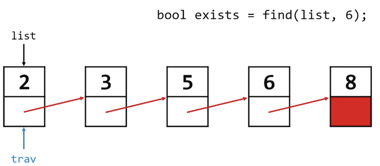
- If the node value is not what we are looking for, we move to the next node by saying
```c
trav = trav->next;
```
- Since we traverse from one node to the next, we do not keep track where we are in relation to the first node. We always go to next. This is one of the downsides of a linked list. In contrast to an array, where we can specify each location by array[2] ... we do not have that kind of random access to any element in a linked list
- As soon as trav->next equals NULL, we no we are at the end of the linked list

### Insert a new node into the linked list
***
- If we want to add an element (node) to the list, we can again construct a function in pseudo code, where we pass in two arguments. First the pointer to the first element and whatever value we want to add to the list
```c
sllnode *new(sllnode *head, VALUE val);
```
- First we need to allocate space for a new sllnode
```c
// Add another number to the list (n already delcrared above, so we     can reuse it)
	n = malloc(sizeof(sllnode));
	```
- Check to make sure we didn't run out of memory
```c
	if (n == NULL)
	{
		free(list);
		return 1;
	}
```
- Populate and insert the node at the beginning of the linked list. The reason why we want to add the new node at the beginning of the list is as follows. We can not track where in the linked list we are, so if we wanted to insert the item at the end of the list, we would have to traverse throughout the list to find the end. The runtime of that would be O(n). But we do have a pointer to the beginning of the list (head), which is much faster
```c
	// First set value and have next point to current head of list
	n->VALUE = 2;
	n->next = list;
```
- Return a pointer to the new head of the linked list
```c
	// Update head of the list to be just created node
	list = n;
```
- Lets visualize this. Here we have a linked list and we want to insert 12 into the list

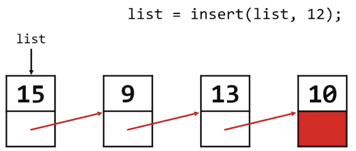
- To insert the value 12 at the beginning of the list, we first malloc memory for our new node malloc(sizeof(sllnode)) and insert the value 12


- Now we have reached a decision point. Which pointer should we move first? Should the "12" node be the new head of the linked list, since it now exists or should we connect it to the first node? This is one of the trickiest things with linked lists. Order matters!

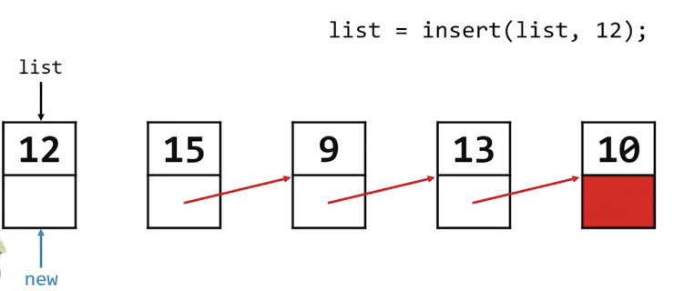
- If we first have list point to the new node we created, how do we tell the new head to point to the "15"? We seem to have lost all reference to point to "15". So we literally orphaned the rest of the list, by making "12" the new head of the list.

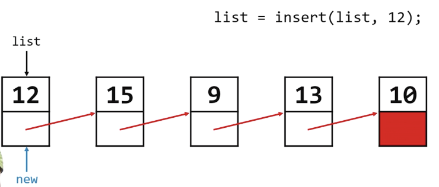
- The solution is to have the "12" next pointer, to point to the old head of the list first, and then have list point to "12". With singly linked list we always want to connect the new element first with the rest of the list and only then we have it be the head

### Delete a single element from a linked list
***
- To delete a single node is a bit tricky. In order to delete a node, we need to have the previous node point to the node after the one we want to delete, in order not to orphan the rest of the list. But singly linked lists do not provide us with a way to go backwards
- This is a topic for doubly linked lists (look below)

### Delete an entire linked list
***
- What if we want to delete an entire linked list. Since we malloced all the space for it, at the end of our program we need to free all that memory again
- A function prototype in pseudo code to delete a linked list might look something like this
```c
void destroy(sllnode *head);
```
- The steps in that function might be
	- if you have reached a null pointer, stop
	- Delete the rest of the list
	- Free the current node

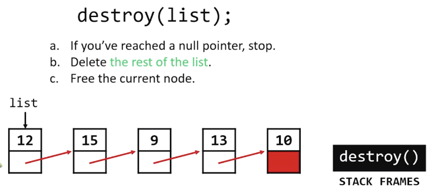
- To the destroy function we pass in the pointer list. Since list does not point to a node with a NULL pointer, we recursively pass in the list->next pointer to destroy
```c
list = list->next;
destroy(list);
```
- So now the delete of "12" is frozen (on the stack) and we look at "15". This again has no NULL pointer so we again call destroy(list) and delete "15" is also added to the stack and so on until we reach "10" that is not a NULL pointer, but contains a NULL pointer. Now list points at the NULL pointer of "10". 

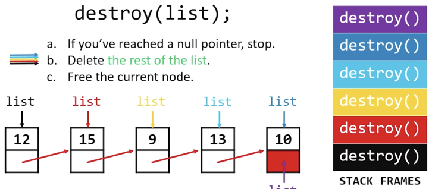
- Now everything is recursively deleted from the stack by freeing the current node (first "15", then "13" until we reach the head of the list "12")
```c
free(list);
```
- So the code could look somehting like this in C
```C
void destroy(sllnode *head)
{
	if (sllnode *head == NULL)
	{
		free(sllnode *head);
			return;
	}

	list = list->next;
	destroy(list);
}
```
***

***
# DOUBLY-LINKED-LIST
***
- Singly linked lists really extend our ability to collect and organize data, but they suffer from a crutial limitation. We can only ever move in one direction through the list
- Consider the implication that would have for trying to delete a single node (for that we need the previous node point to the one after the one we want to delete)
- A doubly-linked list, by contrast, allows us to move forward and backward through the list, all by simply adding one extra pointer to our struct definition
- Whenever you know you will be required to delete single nodes from your list, you should always consider using a doubly linked list. In contrast if you know you will not be required to delete single nodes, you can use a singly linked list and have to benefit of it being less memory intense than a doubly linked list
```C
typedef struct dllist
{
	VALUE val;
	struct dllist *prev;
	struct dllist *next;
}
dllnode;
```
- Almost all operations discussed in for singly linked list are true for doubly linked lists as well. The only exceptions are Insert and Delete of a single node

### Insert a new node into a doubly linked list
***
- We can create a psuedo code function that takes two arguments, the head of the list and a new value and returns a new node
```c
dllnode * insert(dllnode * head, VALUE val);
```
- First we need to allocate space for a new dllnode
```c
// Add another number to the list (n already delcrared above, so we     can reuse it)
	n = malloc(sizeof(dllnode));
	```
- Check to make sure we didn't run out of memory
```c
	if (n == NULL)
	{
		free(list);
		return 1;
	}
```
- Populate and insert the node at the beginning of the linked list. The reason why we want to add the new node at the beginning of the list is as follows. We can not track where in the linked list we are, so if we wanted to insert the item at the end of the list, we would have to traverse throughout the list to find the end. The runtime of that would be O(n). But we do have a pointer to the beginning of the list (head), which is much faster
```c
	// Set new value
	n->VALUE = 2;

	// Fix the prev pointer of the old head of the linked list
	n->next = list;
	n->prev = NULL;
	list->prev = n;
```
- Return a pointer to the new head of the linked list
```c
	// Update head of the list to be just created node
	list = n;
```

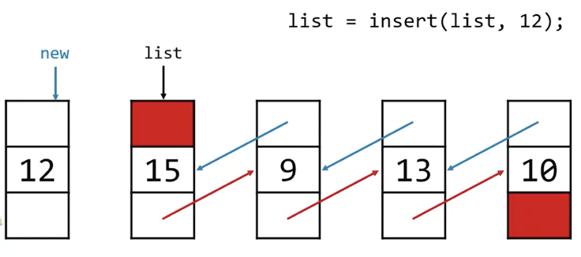
- Again lets visualize the problem. We want to add "12" to our doubly linked list. We again have to carefull in what order we change the pointers, not to orphan our list
- We first have to set the pointers for the "12" node, before we do anything else. So we have "12" next point to "15" and "12" prev to NULL

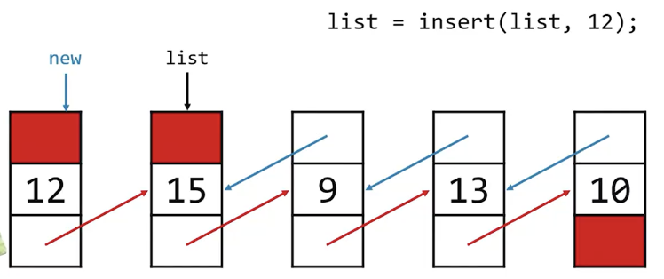
- Now we have to change the "15" prev pointer to point to "12" and finally have list point at the new head of the list, which is "12"

### Delete a node from a doubly linked list
***
- We can create a function prototype that takes as argument only the node, that should be deleted
```c
void delete(dllnode *target);
```
- To do this we have to fix the surrounding nodes pointers to skip over the target and then we free the target node

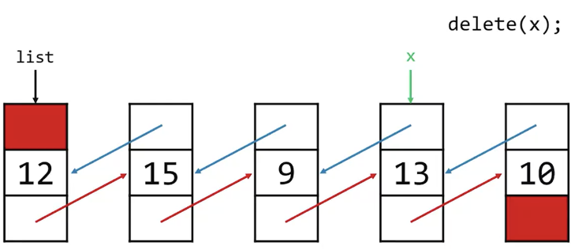
- In this example we want to delete the node marked with x
- First we need to have "9" next point to "10" instead of "13"
- Then we need to point "10" prev to "9"
```c
node9->next = node13->next;
node10->prev = node13->prev;
```

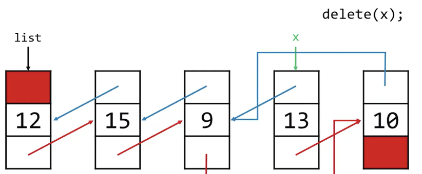

- Linked lists of both the singly and doubly linked varieties, support extremly efficient insertion and deletion of elements. In fact these operations can be done in constant time
- What's the downside? Remember how we had to find an element? We've lost the ability to randomly access list elements (compared to arrays). Accessing a desired element may now take linear time
***

***
# HASH TABLES
***
- Hash tables combine the random access ability of an array with the dynamism of a linked list
- This means (assuming we define our hash table well):
	- Insertion can start to tend toward O(1)
	- Deletion can start to tend toward O(1)
	- Lookup can start to tend toward O(1)
- We're gaining the advantage of both types of data structure, while mitigating the disadvantages
- To get this performance upgrade, we create a new structure whereby when we insert data into the structure, the data itself gives us a clue about where we will find the data, should we need to later look it up
- The trade off is that hash tables are not great at ordering or sorting data, but if we don't care about that, then we're good to go
- A hash table amounts to a combination of two things with which we're quite familiar
	- First, a hash function, which returns an nonnegative integer value called a hash code
	- Second, an array capable of storing data of the type we wish to place into the data structure
- The idea is that we run our data through the hash function and then store the data in the element of the array represented by the returned hash code

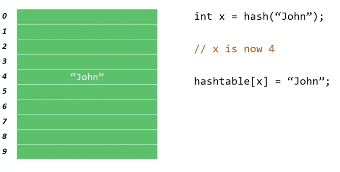
- So if we want to store the string "John" in our hash table, we run the string through our hash function and get the int 4. To check if a string is in the array, we pass the string through the hash function, get an integer, look at hashtable[x] and see if the string is there
- How to define a hash function? Really no limit to the number of possible hash functions
- A good hash function should:
	- Use only the data being hashed
	- Use all of the data being hashed
	- Be deterministic (everytime we pass the exact same piece of data into the hash function, we always get the same exact hash code out. So do not use random numbers!)
	- Uniformly distribute data
	- Generate very different hash codes for very similar data
- An example of a hash function would be the following. It takes a string and adds all its letter's ascii values together and form sum until the Null value at the end of a string is reached. In the sum is compared against the maximum allowed size of the hash table array
```c
usinged int hash(char *str)
{
	int sum = 0;
	for (int j = 0; str[j] != '\0'; j++)
	{
		sum += str[j];
	}
	return sum % HASH_MAX;
}
```
- Generally you should find and use hash function on the internet. If you use them be sure to give credit and cite the source of your hash function

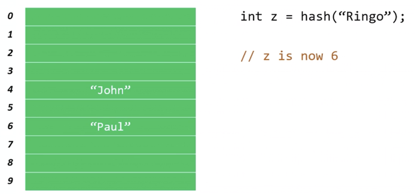
- Now a problem could now be that we can only store one string at a time, because the sum of Paul and Ringo is the same
- A collision occurs when two pieces of data, when run through the hash function, yield the same hash code
- Presumably we want to store both pieces of data in the hash table, so we shouldn't simply overwrite the data that happend to be placed in there first
- We need to find a way to get both elements into the hash table while trying to preserve quick insertion and lookup

### Resolving collisions with "Linear Probing"
- In this method, if we have a collision, we try to place the data in the next consecutive element in the array (wrapping around to the beginning if necessary) until we find a vacancy
- That way, if we don't find what we're looking for in the first location, at least hopefully the element is somewhere nearby

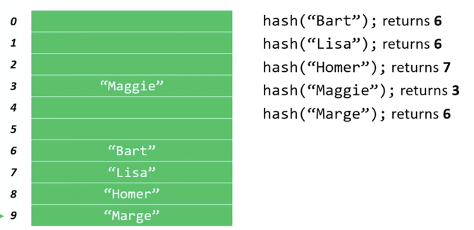
- We can see we keep placing the strings farther away from their hashcodes. We still can look it up quiete quick by just looking at the next and next hash code position of the table, yet we kinda loose the benefit of O(1) and start leaning towards O(n) when it comes to search
- Linear probing is subject to a problem called clustering. Once there's a miss, two adjacent cells will contain data, making it more likely in the future that the cluster will grow
- Even if we switch to another probing technique, we're still limited. We can only store as much data as we have locations in our array

### Resolving collisions with "Chaining"
- What if instead of each element of the array holding just one piece of data, it held multiple pieces of data?
- If each element of the array is a pointer to the head of a linked list, then multiple pieces of data can yield the same hash code and we'll be able to store it all
- We know from experience with linked lists that insertion (and creation, if necessary) into a linked list is an O(1) operation
- For look up, we only need to search through what is hopefully a small list, since we're distributing what would otherwise be one huge list across n lists

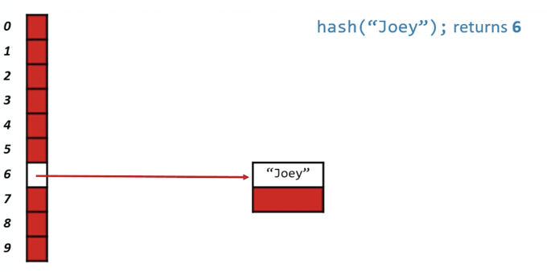
- Now our hash table is an array of 10 nodes initially pointing to NULL and able to store pointers to heads of linked lists
```c
node *hashtable[10];
```
- So when running the string "Joey" through our hash function, we return the hash code 6. At position 6 of our array we store the pointer, pointing at our linked list head, that stores the string "Joey"

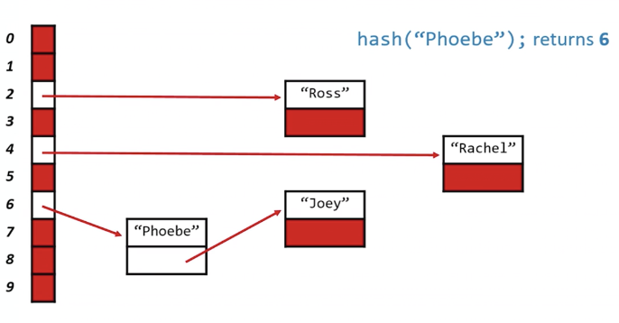
- We can keep adding to pointers to our strings. If we encounter a colission, we just add the new string to the existing linked list and make it its head. So if we hash a string with hash code 6 as its outcome, we can still perform the look up quiete fast, since we do not have to go over all elements, but just the node stored in the linked list, that are pointed to in position 6 for example
***

***
# TRIES
***
- We have seen a few data structures that handle the mapping of key-value pairs
	- Arrays: They key is the element index, the value is the data at that location
	- Hash Tables: They key is the hash code of the data, the value is a linked list of data hashing to that hash code
- What about a slightly different kind of data structure where the key is guranteed to be unique and the value could be as simple as a boolean that tells you whether the data exists in the structure?
- Tries combine structures and pointers together to store data in an interesting way
- The data to be searched for in the trie is now a roadmap. If you can follow the map from beginning to end, the data exists in the trie. If you can't, it does not exist
- Unlike with a hash table, there are no collisions and no two pieces of data (unless they are identical) have the same path
- Let's map key-value pairs where the keys are four digit years (YYYY) and the values are names of universities founded during those years
- In a trie, the path from a central root node to a leaf node (where the school names would be), would be labeled with digits of the year
- Each node on the path from root to leaf could have 10 pointers emanating from it, one for each digit
- To insert an element into the triem simply build the correct path from the root to the leaf
```c
typedef struct _trie
{
	char university[20];       // University name
	struct _trie *paths[10];  // 10 pointers to other leafs
}
trie;
```

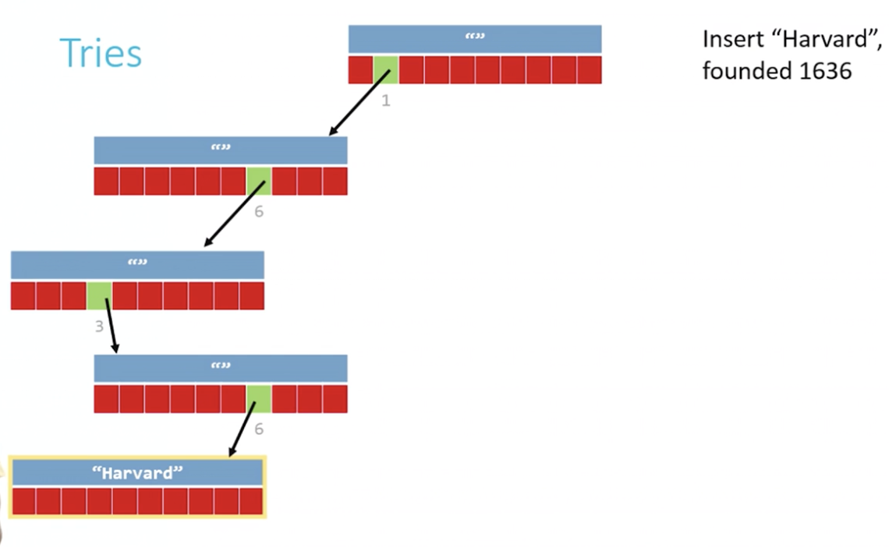
- Here we want to insert "Harvard" and the year is 1636. So in the first node, called root, we malloc a new node and store a pointer in 1, pointing to the just created new node. From there we take the second digit of our year 6 and store a pointer at location 6 to another new node and so on ... Once we reached the node with the last digit, here 6, we store a pointer to another new node, which we will call Harvard
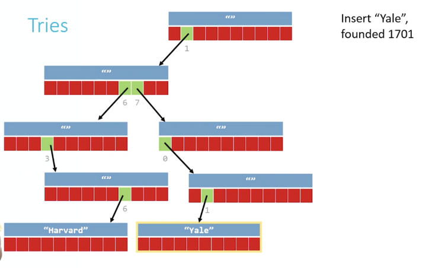
- If we now wanted to insert "Yale" founded in 1701, we do the same thing. Except this time, we can reuse the first 1 pointer and the node it points to. From there on we have to malloc our new nodes and store their respective pointers

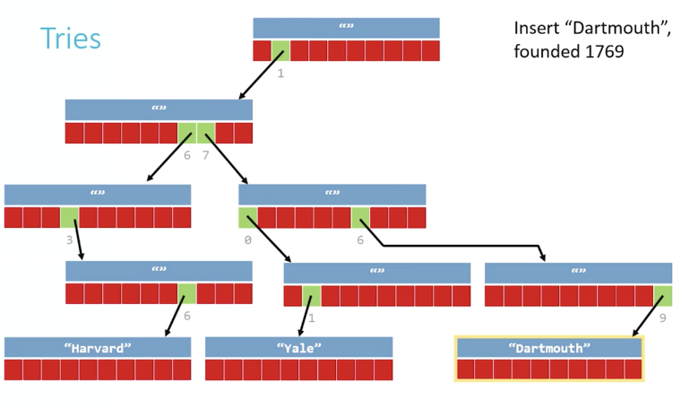
- To search for an element in the trie, use successive digits to navigate from the root and if you can make it to the end without hitting a dead end (a NULL pointer) you've found it
- To search through the trie, it is advisable to create a traversal pointer, to protect the original pointer and avoid orphaning our data by accident
```c
// create trav pointer to equal root
trav = root;
```
***

***
# PYTHON
***
- Python is an example of a very commonly-used modern programming language. C was first released in 1972, Python in 1991
- Python is an excellent versatile language choice for making complex C operations much simpler, like String Manipulation or Networking
- Fortunately, Python is heavily inspired by C (its primary interpreter CPyhton is actually written in C) and so the syntax should be a shallow learning curve
- To start writing Python, open up a file with the .py extension
- Unlike a C program, which typically has to be compiled before you can run it, a Python program can be run without explicitly compiling it first
- Important Note: In CS50, we teach Python 3

## Variables
- Python variables have two big differences from C
	- No type specifier (int, float ...)
	- Declared by initialization only (like in C int x; was possible, in Python you always have to initialize with a value, for example x = 0)
	- Python statements do not need to end with semicolons!

## Conditionals
- All of the old favorites from C are still available for you to use, but they look a little bit different now

```Python
# If Statement (==, !=, and, or)
if y < 43 or z == 15:
	# code goes here
elif:
	# code goes here
else:
	# code goes here

# True False
letters_only = True if input().isalpha() else False
```

## Loops
- We have to variants of loops in Python, while and for

```Python
# While Loop
counter = 0
while counter < 100:
	print(counter)
	counter += 1

# For Loop
for x in range(100):
	print(x)
```

## Lists []
- Here's where things really start to get a lot better than in C
- Python arrays (more appropriately known as lists) are NOT fixed in size. They can grow and shrink as needed and you can always tack extra elements onto you array and splice things in and out easily

```Python
# Delcare a list
nums = []
nums = list()

# Add item to end of list
nums.append(5)

# Attach one list to the end of another list
nums[len(nums):] = [5]

# Add item to 4th position (index 4) in list
nums.insert(4, 5)

# List comprehension (for loop inside list to generate content)
nums = [x for x in range(500)]
```

## Tuples ()
- Python also has a data type that is not quite like anything comparable to C, a tuple
- Tuples are ordered, immutable sets of data. They are great for associating collections of data, sort of like a struct in C, but where those values are unlikely to change

```Python
# List of tuples
presidents = [("George Washington", 1789), ("John Adams", 1797), ("Thomas Jefferson", 1801), ("James Madison", 1809)]

# Iterate through list of tuples
for prez, year in presidents:
	print("In {1}, {0} took office".format(prez, year))
```

## Dictionaries {}
- Python also has a built in support for dictionaries, allowing you to specify list indices with words or phrases (keys), instead of integers, which you were restricted to in C

```Python
# Dictionary
pizzas = {"cheese": 9, "pepperoni": 10, "vegetable": 11, "buffalo chicken": 12}

# Change Value of key
pizzas["cheese"] = 8

# Add key to dictionary
pizzas["bacon"] = 14
```

- But this creates a somewhat new problem ... how do we iterate through a dictionary? We don't have indexes ranging from [0, n-1] anymore. We use a for loop to iterate over a dictionary

```Python
# pie is just used like i

# iterate over keys
for pie in pizzas:
	# do something

# iterate over keys and values (note we have to use .items)
for pie, price in pizzas.items():
	# do something
```

## Printing
- format gives one way to interpolate variables into our printed statements in a very printf like way

```Python

print("A whole {} pizza costs ${}".format(pie, price))

print("A whole" + pie + " pizza costs $" + str(price))

# Deprecated, avoid in Python 3
print("A whole %s pizza costs $%2d" % (pie, price))
```

## Functions
- Python has support for functions as well. Like variables, we don't need to specify the return type of the function (because it does not matter), nor the data types of any parameters
- All functions are introduced with the def keyword. Also, no need for main. The interpreter reads from top to bottom in Python! If you wish to define main nonetheless (and you might want to), you must at the very end of your code have:

```Python
# call main loop if defined
if __name__ == "__main__":
	main()

# A function in  Python
def square(x):
	return x * x
```

## Objects (class)
- Python is an object-oriented programming language
- An object is sort of analogous to a C struct
- C structs contain a number of fields, which we might also call properties
- Objects meanwhile, have properties but also methods or functions that are inherent to the object, and mean nothing outside of it. You define the methods inside an object also. Thus, properties and methods don't ever stand on their own (they have to be called with the .operator on the object created car.year or car.model)
- You define a type of object using the class keyword in Python
- Classes require an initialization function, also more generally known as a constructor, which sets the starting values of the properties of the object
- In defining each method of an object, self should be its first parameter, which stipulates on what object the method is called

```Python

class Student():

	# Constructor
	def __init__(self, name, id):
		self.name = name
		self.id = id

	# Method
	def changeID(self, id):
		self.id = id

	# Method
	def print(self):
		print("{} - {}".format(self.name, self.id))

# Create new student object
jane = Student("Jane", 10)

# Call object method
jane.changeID(16)
```

## Style
- If you haven't noticed, good style is crucial in Python
- Tabs and indentation, actually matter in this language and things will not work the way you intend for them to if you disregard styling!
- Good news? No more curly braces to delineate blocks! Now they are used to declare dictionaries

## Including Files
- Just like C programs can consist of multiple files to form a single program, so can Python programs tie files together

```Python
import module
from module import function
```

## Syntax
- Python programs can be prewritten in .py but you can also write and test short Python snippets using the Python interpreter from the command line
- All that is required is that the Python interpreter is installed on the system you wish to run your Python programs on

```bash
python file.py
```

- You can also make your programs look a lot more like C programs when they execute by adding a shebang to the top of your Python files, which automatically finds and executes the interpreter for you

```Python
#!/usr/bin/env python3
```

- If you do this, you need to change the permissions on your file as well, using the Linux command chmod as follows

```bash
chmod a+x file.py

./file.py
```
***

***

# SQL
***
- Often times in order for us to build the most functional website or program we depend on a database to store information
- If you've ever used Microsoft Excel or Google Spreadsheets, odds are you're familiar with the notion of a database: A hierarchically organized set of tables, each of which contains a set of rows and columns
- SQL (the Structured Query Language) is a programming language whose purpose is to query a database
- MySQL is one opensource platform on which you can establish the type of relational database that SQL is most adept at working with. SQLite is another, which we've actually use in CS50
- Manys installations of SQL come with a GUI tool called phpMyAdmin, which can be used to execute database queries in a more user-friendly way
- After you create a database, the next thing you'll most likely want to do is to create a table. The syntax for doing this is actually a bit awkward to do programmatically, at least at the outset and so this is where phpMyAdmin will come in handy
- As part of the process of creating a table, you'll be asked to specifiy all of the columns in that table
- Thereafter all your queries will refer to rows of the table
- Each column of your SQL table is capable of holding data of a particular data type

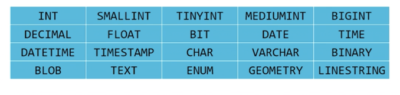

- SMALLINT and BIGINT are just integers with different upper bounds
- Unlike C, the CHAR data type in SQL does not refer to a single character. Rather it is a fixed-length string. In most relational databases, including MySQL, you actually specify the fixed-length as part of the type definition e.g. CHAR(10). If you stored the word "Hi" in a CHAR column, that would work, but the string would be filled with 8 NULL characters to fit the length of 10
- A VARCHAR refers to a variable length string. VARCHARs also require you to specify the maximum possible length of a string that could be stored in that column e.g. VARCHAR(99)
- SQLite has these data types as well, but affiliates each with a "type affinity" to simplify things. The entire list of SQL data types can be reduced to the data types below


- NULL = Nothing
- INTEGER = whole numbers
- REAL = floats
- TEXT = strings
- BLOB = for data or bits

- One other important consideration when constructing a table in SQL is to choose one column to be your primary key
- Primary keys enable rows of a table to uniquely and quickly identified. Choosing your primary key appropriately can make subsequent operations on the table much easier
- It is also possible to establish a joint key - a combination of two columns that is always guranted to be unqiue
- SQL is a programming language but its vocabulary is failry limited. We will primarily consider just four operations one may perform on a table
	- INSERT
	- SELECT
	- UPDATE
	- DELETE

- For all examples hereafter we will consider these two tables:

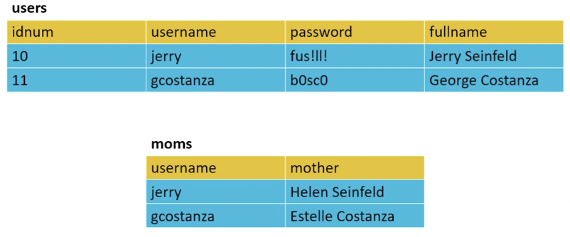

## INSERT
- Add information to a table
- The general structure of an insert querie is build like this

```SQL
INSERT INTO <table>(<columns>) VALUES(<values>)

INSERT INTO users(username, password, fullname) VALUES ('newman', 'USMAIL', 'Newman')
```

- columns and values is a comma seperated list. So to insert to multiple columns you would comma seperate all columns you want to insert to. Same for values, you would sperarate all values you want to insert with a comma
- When defining the column that ultimately ends up being your table's primary key, it's usually a good idea to have that column be an integer
- Moreover, so as to eliminate the situation where you may accidentally forget to specify a real value for the primary key column, you can configure that column to autoincrement, so it will pre-populate that column for you automatically when rows are added to the table (our insert example added a new idnum for our entry automatically without us specifing it)

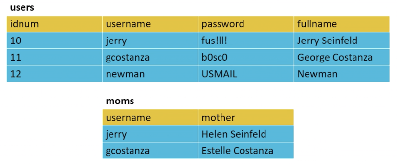

## SELECT
- Where insert is used to insert information into a table, select is used to get that information back out of the table

```SQL
SELECT <columns> FROM <table> WHERE <condition/predicate> ORDER BY <column>

SELECT idnum, fullname FROM users
```

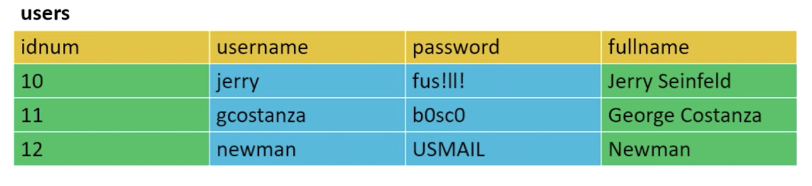

```SQL
SELECT password FROM users WHERE idnum < 12
```

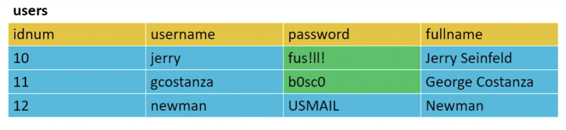

```SQL
SELECT * FROM moms WHERE username = 'jerry'
```

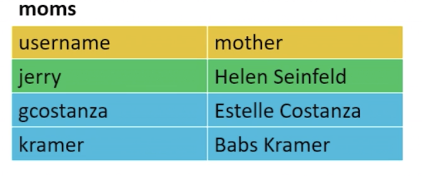

- * will return all columns
- Databases empower us to organize information into tables efficiently. We don't always need to store every possible relevant piece of information in the same table, but can use relationships across the tables to let us pull information from where we need 

## SELECT (join)
- What if we now find ourselves in a situation where we need to get a user's full name (from the users table) and their mother's name (from the moms table)

```SQL
SELECT <columns> FROM <table1> JOIN <table2> ON <condition/predicate>

SELECT users.fullname, moms.mother FROM users JOIN mums ON users.username = moms.username
```


## UPDATE
- Modify information in a table

```SQL
UPDATE <table> SET <column> = <value> WHERE <condition/predicate>

UPDATE users SET password = 'yadayada' WHERE idnum = 10
```

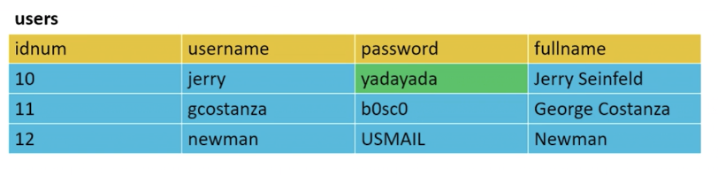

## DELETE
- Remove information from a table

```SQL
DELETE FROM <table> WHERE <condition/predicate>

DELETE FROM users WHERE username = 'newman'
```

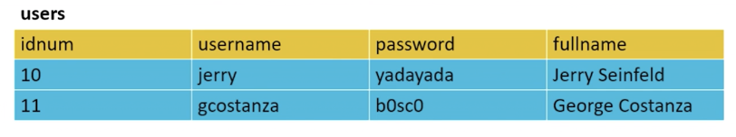

- All of these operations are pretty easy to do in the graphical interface of phpMyAdmin. We want to do this programmatically not just typing SQL command into the SQL tab of phpMyAdmin. 
- Fortunately SQL integrates with other programming languages such as Python or PHP very easily
***

***
# INTERNET BASIC
***
- We have reached the point in the course where we begin the transition away from the command-line oriented world of C and start considering the web-based world of JavaScript and the like
- Before we dive headlong into that world, it's a good idea to have a basic understanding of how humans and computers interact over the internet

## IP Address
- In order for your machine to uniquely identify itself on the internet, it needs an address. This way, it can send information out and also recieve information back to the correct location
- The addressing scheme used by computers is known as IP addressing
- As originally developed, the IP addressing scheme would effectively allocate a unique 32-bit address to each device hoping to connect to the internet
- Instead of representing these 32-bit addresses as hexadecimal, we represent them as four clusters of 8-bits using decimal notation
  w.x.y.z
- Each of w, x, y and z can be a nonnegative value in the range [0, 255]
- If each IP address is 32-bits, that means there are roughly 4 billion addresses to give out
- The population of the world is somewhere in excess of 7 billion and most folks in the western world have more than 1 device capable of internet connectivity. Some workarounds have allowed us to deal with this problem
- In recent years, we've been slowly phasing out this old scheme (IPv4) and replacing it with a newer scheme (IPv6) that assigns computers 128-bit addresses instead of 32-bit addresses
   s:t:u:v:w:x:y:z
- Each of s, t, u, v, w, x, y, z is represented by 1 to 4 hexadecimal digits in the range [0, ffff]

## DHCP
- How do we get an IP address in the first place? Surley we can't just choose any one we want. What if it was already taken?
- Somewhere between your computer and the internet at large exits a Dynamic Host Configuration Protocol (DHCP) server sits, whose role is to assign IP addresses to devices
- Prior to the widespread promulgation of DHCP, the task of assigning IP addresses fell to a system administrator, who would need to manually assign such addresses

## DNS
- Odds are you've never actually tried to visit a website by typing its IP adress into your browser
- The Domain Name System (DNS) exists to help us translate IP addresses to more memorable names that are more human-comprehensable
- In this way, DNS is somewhat like the yellow pages of the web
- Much like there is no yellow pages of the world, there is really no DNS record of the entire internet
- Rather, large DNS server systems (like Google's own) are more like aggregators, collecting smaller sets of DNS information and pooling them together, updating them frequently


## ACCESS POINTS
- One of the ways we've dealt with the IPv4 addressing problem is to start assigning multiple people to the same IP address
- The IP address is assigned to a router, whose job it is to act as a traffic cop that allows data requests from all of the devices on your local network (your home or business, e.g.) to be processed through a single IP address
- Modern home networks consist of access points that combine a router, a modem, a switch and other technologies together into a single device
- Moden business networks or large scale wide area networks (WANs) still frequently have these as separate devices to allow the sitze of their netowork to scale more easily
***

***
# IP
***
- IP is the Internet Protocol
- As discissed previously "the internet" is really an interconnected network comprised of smaller networks woven together and agreeing to communicate with one another
- How do these networks know how to communicate with one another? This is the responsibility of the Internet Protocol "IP"
- Though it's admittedly on an extremly small scale, this picture is misleading as it pertains to network communication

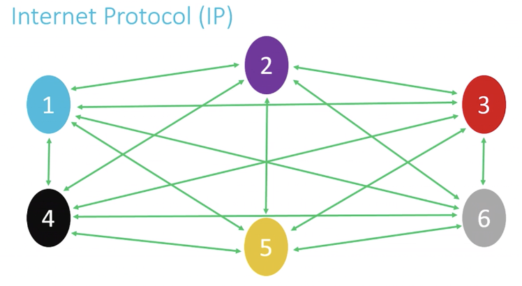

- With only six networks, things are rapidly getting out of hand and the modern Internet consists of a lot more networks. We simply can't afford to wire them together such that each directly connects with every other
- But still we need each network to be able to talk to each other network or we end up with pieces of the network that are unable to speak to other parts of the network
- This is where routers come back into play
- What if instead of being connected to every other network, each network was connected to a limited number of routers (each of which was connected to other nearby routers) and each router had instructions built into it on how to move information toward its destination?
- This information might be stored in a routing table instead of the router
- For this illustration let's assume each network has IP addresses in the range of n.x.x.x where n is its network number and each x is in the range [0, 255].

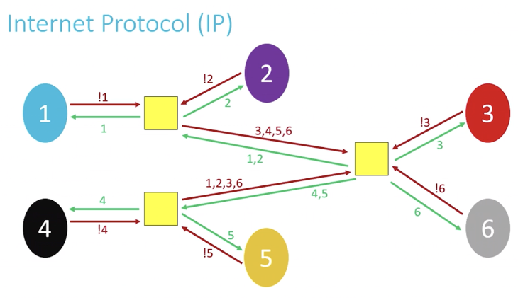

- Now the networks are not directly connected to each other at all, and rely on routers to distribute communications
- On a small scale this configuration may actually be more inefficient than just having direct connections
- On a large scale this configuration can dramatically reduce the costs of network infrastructure
- In reality if 1.208.12.37 (me) is sending an e-mail, FTP file or web browser request to 5.188.109.14 (you), the data isn't being sent as one huge block
- Any slowdown that was caused by sending such a large amount of data would have a ripple effect that would throttle the network for all other users
- As such, another crucial part of IP is splitting data into packets
- IP is also known as connectionless protocol. There is not necessarily a defined path from the sender to the the receiver and vice versa
- This means that in response to traffic that might be "clogging" up one particular path through the internet, some packets can be "re-routed" around the traffic jam to follow the most optimal path, based on the current state of the network
- The routing table then probably consists of more information that just "where do I send this package from here" but also information "what is the cost of using that particular route"
- Another side effect of being connectionless is that delivery cannot be guaranteed since the path from sender to receiver is not guranteed to be consistent
***

***
# TCP
***
- TCP stand for Transmission Control Protocol
- If the Internet Protocol (IP) is thought of as the protocol for getting information from a sending machine to a receiving machine, the Transmission Control Protocol (TCP) can be thought of as directing the transmitted packet to the correct program on the receiving machine
- As you might imagine, it is important to be able to identify both where the receiver is and what the packet is for, so the TCP and IP are almost an inseperable pair, hence TCP/IP
- Each program/utility/service on a machine is assigned a port number. Coupled with an IP address, we can now uniquely identify a specific program on a specific machine
- The other thing that TCP is crucial for is guranteeing delivery of packets, which IP alone does not do
- TCP does this by including information about how many packets the receiver should expect to get and in what order, and transmitting that information alongside the data
- Some ports are so commonly used that they have been standardized across all computers
	- FTP (file transfer) uses port 21
	- SMTP (e-mail) uses port 25
	- DNS uses port 53
	- HTTP (web browsing) uses port 80
	- HTTPS (secure web browsing) uses port 443

- Steps of the TCP/IP process:
	1. When a program goes to send data, TCP breaks it into smaller chunks and communicates those packets to the computer's network software, adding a TCP layer onto the packet
	2. IP routes the individual packets from sender to receiver, this info is part of the IP layer sourrounding the packet
	3. When the destination computer gets the packet, TCP looks at the header to see which program it belongs to and since the routes packets take may differ, TCP must also present those packets to the destination program in the proper order

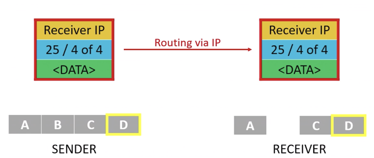

- If at any point along the way the router delivering information using the IP dropped a packet, TCP would use additional information insde the headers to request that the sender pass along the extra packet so it could complete assembly
- After the packets have arrived, TCP ensures they are organized the correct order and can then be reassembled into the intended unit of data and delivered to the correct service
***

***
# HTTP
***
- HTTP stand for Hyper Text Transfer Protocol
- In addition to protocols that dictate how information is communicated from machine to machine and application to application (TCP/IP) it is frequently the case that the application itself has a system of rules for how to interpret the data that was sent
- HTTP is one such example of an application layer protocol, which specifically dictates the format by which clients request web pages from a server and the format via which servers return information to clients
- Other application layer protocols include:
	- File Transfer Protocol (FTP)
	- Simple Mail Transfer Protocol (SMTP)
	- Data Distribution Service (DDS)
	- Remote Desktop Protocol (RDP)
	- Extensible Message and Presence Protocol (XMPP)

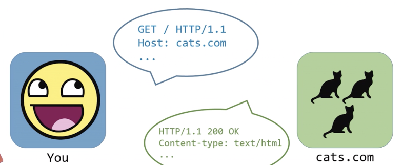

- A line of the form [method request-target http-version] is a simple example of an HTTP request line, a crucial part of an overall HTTP request that a client may make to a server
- The host name (domain name of the server) is also included as a seperate line of the overall HTTP request
- Taken together, the host name and the request target from the request line specify a specific resource being sought
- Based on whether the resource exists and whether the server is empowered to deliver that resource pursuant to the client's request, a number of status codes can result
- A status code is part of the first line that a server will use to respond to an HTTP request
		http_version status

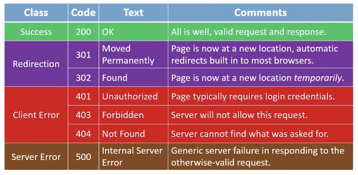

***

***
# HTML
***
- HTML stands for Hypertext Markup Language
- HTML is a language, but it is NOT a programming language. It lacks concepts of variables, logic, functions and the like
- Rather it is a markup language, using angle-bracket enclosed tags to semantically define the structure of a web page, causing the plain text inside of sets of tags to be interpreted by web browsers in different ways

```HTML
<html>
	<head>
		<title>
			Hello World
		</title>
	</head>
	<body>
		World, Hello
	</body>
</html>
```

- Notice how the markup allows us to convey extra information about the text we've written
- There are over 100 HTML tags and lots of great resources online to find them. We won't cover them all here
- Another interesting way to learn about HTML tags is to view the source of a website you frequent by opening your browser of choice's developer tools
- Common HTML Tags:

```HTML

Text between these tags will be rendered boldface
<b> </b>

Text between these tags will be rendered italics
<i> </i>

Text between these tags will be rendered underlined
<u> </u>

Text between these tags will be rendered paragraphed
<p> </p>

Text between these tags will be rendered as X-Level section header X from 1 to 6
<hX></hX>

Demarcate beginning and end of unordered (bulleted) list
<ul> </ul>

Demarcate beginning and end of ordered (numbered) list
<ol> </ol>

Demarcate list items with an ordered/unordered list
<li> </li>

Demarcate the beginning and end of a table definition
<table> </table>

Demarcate the beginning and end of a row within a table
<tr> </tr>

Demarcate the beginning and end of a column within a row within a table
<td> </td>

Demarcate the beginning and end of an HTMl form
<form> </form>

Demarcate the beginning and end of an arbitrary HTML page division
<div> </div>

Define a field with an HTML form. X is a unique id for that field, Y is what type of data it accepts
<input name=X type=Y />

Creates a hyperlink to a webpage X with the text between the tags rendered and cuntional as the link text
<a href="https://www.google.de"> google </a>

Another self-closing tag for displaying an image at X, with possible additional attributes


Specific to HTML5, lets the browser know that's the standard you're using
<!DOCTYPE html>

Demarcate the beginning and end of an HTML comment
<!--  text -->
```

- Beyond these tags as explained here, each can also have multiple attributes that slightly modify the tag
- It is important that HTML you write be well-formed. Every tag you open should be closed (unless it is a self-closing tag), and tags should be closed in reverse order of when they were opened
- Unlike C, your HTML will not necessarily fail with syntax errors if not well-formed, so it's up to you to be vigilant
- Because it can be an arduous task to investigate this, be sure to use online HTML validators to help
***

***
# CSS
***
- CSS stand for Cascading Style Sheets
- CSS is another language we use when constructing websites. If HTML is used to organize the content that we aim to display on our pages, then CSS is the tool we use to customize our website's look and feel
- Like HTML, CSS is not a programming language, it lacks logic. Rather it is a styling language and its syntax describes how certain attributes of HTML elements should be modified

```CSS
body
{
	background-color: blue;
}
```

- A style sheet is constructed by identifying a selector (in the example above it is body) and then an open curly brace to indicate the beginning of the style sheet for that selector
- In between the curly brace you place a list of key-value pairs of style properties and values for those properties, each declaration ending with a semicolon
- Then a closing curly brace terminates the style sheet
- Common CSS properties:

```CSS

/* Applies a border of the specific color, width and style */
border: style color width;

/* Sets the background color*/
background-color: [keyword or #6-digit-hex];

/* Sets the foreground color */
color: [keyword or # 6-digit-hex];

/* Can use keywords, fixed points, percentage or base off most recent font size */
font-size: [absolute size or relative size]

/* Certain "web safe" fonts are pre-defined in CSS */
font-family: [font name or generic name]

/* Text align */
text-align: [left right center justify]
```

- Your selectors don't have to apply only to HTML tag categories. There also exist ID selectors and class selectors
- A tag selector will apply to all elements with a given HTML tag

```CSS

h2
{
	font-familiy: times;
	color: #fefefe;
}
```

- An ID selector will apply to an HTML tag with a unique identifier

```CSS

#unique
{
	border: 4px dotted blue;
	text-align: right;
}
```

- A class selector will apply only to those HTML tags that have been given identical "class" attributes

```CSS

.students
{
	background-color: yellow;
	opacity: 0.7;
}
```

- Style sheets can be written directly into your HTML by placing them within <style> </style> tags within your page's head
- Style sheets can also be written as seperate CSS files and then linked into your document by using <link> tags within your page's head to accomplish this [prefered way!]

```HTML
<html>
	<head>
		<link href="my.css" rel="stylesheet" />
	</head>
</html>
```

***

***
# JAVASCRIPT
***
- JavaScript is a modern programming language that is derived from the syntax at C
- It has been around just about as long as Python, having been invented a few years later in 1995
- JavaScript, HTML and CSS make up three languages defining most of the user experience on the web
- To start writing JavaScript open up a file with the .js file extension
- No need for any code delimiters like you may be familiar with if you've used a language like PHP. Our website will know that our file is JavaScript because we'll explicitly tell it as much in an HTML tag
- Unlike Python which runs server-side, JavaScript applications run client_side on your own machine
- Just like CSS with <style> </style> tags, you can directly write your JavaScript between <script> </script> tags
- Just like with <link> tags you can write your JavaScript in a seperate file and link them in by using the src attribute of the <script> </script> tag [prefered way!]

## Variables
- JavaScript variables are similar to Python variables. No type specifier and when local variables are first declared, preface them with a var keyword

```JavaScript

// local variable
var x = 44;

// global variable
x = 44;
```

## Conditionals
- All of the old favorites from C are still available for you to use
	- if
	- else if
	- else
	- switch
	- ?:

```JavaScript
// if statement
if (condition){
//code
}
else{
//code
}
```

## Loops
- All of the old favorites from C are still available for you to use
	- while
	- do-while
	- for

## Functions
- All functions are introduced with the function keyword
- JavaScript functions, particulary those bound specifically to HTML elements, can be anonymous (you dont't have to give them a name)

## Arrays
- Declaring an array is pretty straightforward

```JavaScript

var nums = [1, 2, 3, 4, 5];
```

## Objects
- JavaScript has the ability to behave in a few different ways but in particular it can behave as an object-oriented programming language
- An object is sort of analogous to a C structure
- C structures contain a number of fields or members which we might also call properties. But the properties themselves can not ever stand on their own

```C
struct car
{
	int year;
	char model[10];
}
struct car herbie;
herbie.year = 1963;
herbie.model = "Beetle";
// Note we always refer to herbie not just year or model by itself
```

- Objects in JavaScript meanwhile have properties but also methods or functions that are inherent to the object and mean nothing outside of it. Thus like properties can methods not ever stand on their own

```JavaScript
object.function();
```

- The fields and methods of an object are similar in spirit to the idea of a dictionary with which we're familiar from Python

```JavaScript
var herbie = {year : 1963, model : "Beetle"};
```

## Loops (redux)
- How do we iterate across all of the key-value pairs of an object or indeed all of the elements of an array?

```Python
for key in list:
	# use the key in here as stand-in for list[i]
```

```JavaScript
// iterate over keys
for (var key in object)
{
	// use object[key] in here
}

// iterate over values
for (var key of object)
{
	// use key in here
}
```

```JavaScript
// Example

var wkArray = ['Monday', 'Tuesday', 'Wednesday', 'Thursday', 'Friday', 'Saturday', 'Sunday'];

for (var day in wkArray)
{
	console.log(day);
}

// Output:
// 0
// 1
// 2
// ...
// because there are not keys, only values so it prints the indicies

for (var day of wkArray)
{
	console.log(day);
}

// Output:
// Monday
// Tuesday
// ...

// Printing and variable interpolation
console.log(wkArray[day] + ' is day number ' + (parseInt(day) + 1) + ' of the week!');

//Output:
// Monday is day number 1 of the week!
// Tuesday is day number 2 of the week!
// ...
// pareseInt makes the day an int
```

- Since we are not declaring types for variables, JavaScript is basically guessing them for us, which may sometime lead to a wrong interpretation. In the example above (for the console.log) it would see day + 1 as string "day" + "1" and result in "day1". To avoid this, we specifiy day to be read as Int (parseInt)

## Functions (redux)
- Arrays are a special case of an object (in fact, everything in JavaScript is a special case of an object. var x = 4 is an object with only one property) and has numerous methods that can be applied to them

```JavaScript
array.size();
array.pop();
array.push(x);
array.shift();
```

- There is also a method for arrays called map(), which can be used to apply a function to all elements of an array. A great situation to use an anonymous function

```JavaScript
var nums = [1, 2, 3, 4, 5];

// Apply an ananymous function (function has no name) to all elements of the array. The function takes num as input and multiplies each element by 2 and returns the array in its altered state
nums = nums.map(function(num){
	return num * 2;
})
```

## Events
- An event in HTML and JavaScript is a response to user interaction with the web page. A user clicks a button, a page has finished loading, a user has hovered over a portion of the page, the user typed in an input field
- JavaScript has support for event handlers which are callback functions that respond to HTML events. Many HTML elements have support for events as an attribute

```HTML
<html>
	<head>
		<title>Event Handler</title>
	</head>
	<body>
		<button onclick="">Button 1</button>
		<button onclick="">Button 2</button>
	</body>
</html>
```

- We can write a generic event handler in JavaScript, creating an even object that will tell us which of these buttons was clicked

```HTML
<html>
	<head>
		<title>Event Handler</title>
	</head>
	<body>
		<button onclick="alertName(event)">Button 1</button>
		<button onclick="alertName(event)">Button 2</button>
	</body>
</html>
```

```JavaScript
function alertName(event)
{
	var trigger = event.srcElement;
	alert('You clicked on ' + trigger.innerHTML);
}
```

- innerHTML is what is between the <button></button> tags. So here it is either Button 1 or Button 2
***

***
# DOM
***
- DOM stand for Document Object Model
- As we've seen JavaScript objects are incredibly flexible and can contain various fields, even when those fields are other objects
- The document object is one way of employing this paradigm whereby that object organizes the entire contents of a web page
- By organizing an entire page into a JavaScript object, we can manipulate the page's elements programmatically

```HTML
<html>
	<head>
		<title>Hello, World</title>
	</head>
	<body>
		<h2>Here's my page</h2>
		<p>World, Hello</p>
		<a href="test.html">Link</a>
	</body>
</html>
```

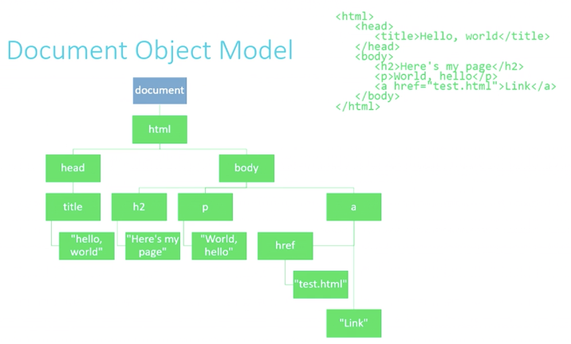

- The document object itself, as well as all of the objects contained within it, have a number of properties and a number of methods than can be used to drill down to a very specific pieve of your website
- By resetting those properties or calling certain methods, the contents of our web pages can change without us needing to refresh the page

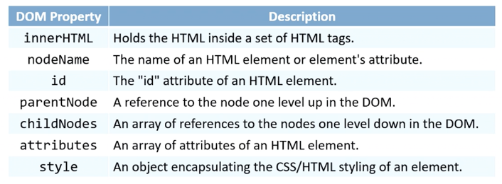

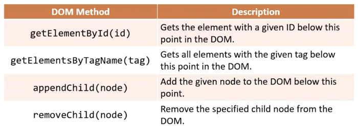

- If we start from document we can get to any piece of our web page that we choose through careful use of the DOM properties and methods

## jQuery
- Because DOM manipulation is so common with JavaScript and because the JavaScript to do so can get quite lengthy, people wanted alternatives
- jQery is a popular open-source library released in 2006, that is designed to simplify client-side scripting (such as DOM manipulations)

```JavaScript

// Find the node called colorDiv and change background color to green using only JavaScript
document.getElementById('colorDiv').style.backgroundColor = 'green';

// The same using jQuery
$('#colorDiv').css('background-color', 'green');
```

***

***
# FLASK
***
- Python is not just used for command-line programming, though that's a major use case
- Python contains native functionality to support networking and more, enabling site backends to be written in Python
- Web frameworks make this process much easier, abstracting away the minutia of Python's syntax and providing helper functions
- Some of the most popular include Django, Pyramid and Flask
- We use Flask in CS50 because it is lightweight for ease of use in CS50 IDE, while still being feature-rich
- We know that we can use HTML to build websites, but websites using pure HTML suffer from serious limitation
- Imagine we want to create a website that displays the current time in Cambridge MA, displaying it to the latest minute

```HTML
<html>
	<head>
		<title>
			Current Time in Cambridge
		</title>
	</head>
	<body>
		The current time in Cambridge is 14:08
	</body>
</html>
```

- Websites that are pure HTML are completely static. The only way we can update the content of our pages is to manually open up our source files, edit and save and then the next time the user visits or refreshes the page, they'll get the content
- Incorporating Python into our code can make our code quite a bit more flexible and introduce a way for our pages to update or be dynamic without requiring our intervention

```Python
from flask import Flask
from datetime import datetime
from pytz import timezone

app = Flask(__name__)

@app.route("/")
def time():
	now = datetime.now(timezone('America/New_York'))
	return "The Current date and time in Cambridge is {}".format(now)
```

- It's pretty simple to get started using Flask within CS50 IDE

```Python
from flask import Flask
```

- lower case flask is the name of the module and upper case Flask is the name of the function or class we want to import from flask
- After importing the Flask module, we need to initiate a Flask application

```Python
app = Flask(__name__)
```

- The underscore underscore name underscore underscore takes the name of the Python file within it exists. For Flask that would be the standard app.py
- From there it's just a matter of writing functions that define the behaviour of our application

```Python
@app.route("/")
def index():
	return "You are at the index page!"

@app.route("/sample")
def sample():
	return "You are on the sample page!"
```

- The lines with the @ are known as "decorators". They are used in Flask to associate a particular function with a particular URL
- Decorators also have more general use in Python, but that goes beyond the scope of CS50
- To run the file you enter the following into the terminal (the first two only once)

```Bash
export FLASK_APP=app.py
export FLASK_DEBUG=1
flask run
```

- Data can be passed in via URLs, akin to using HTTP GET

```Python
@app.route("/show/<number>")
def show(number):
	return "You passed in {}".format(number)
```

- Data can be passed in via HTML forms, as with HTTP POST, but we need to indicate that Flask should respond to HTTP POST requests explicitly because Flask by default only uses GET

```Python
@app.route("/login", methods=['GET', 'POST'])
def login():
	if not request.form.get("username")
		return apology("must provide username")
```

- With the if statement we ask Flask to look at the username and if it is not provided we send the apology with text, making the username a requirement
- We could also vary the behavior of our function depending on the type of HTTP request received:

```Python
@app.route("/login", methods=['GET', 'POST'])
def login():
	if request.method == "POST":
		# do one thing
	else:
		# do a different thing
```

- Flask has a number of functions within its module that will be useful for application development
***

***
# AJAX
***
- Up until now, our interaction with JavaScript has been mostly limited to: push a button and something happens
- We still don't have to entirely reload our page, but there is still some degree of user interaction
- Ajax (formerly Asynchronous JavaScript and XML) allows us to dynamically update a webpage even more dynamically. Though, for now we won't go too crazy
- It basically allows us to refresh sections of our webpage without refreshing the entire page, hence asynchronous since it is not depending on the refresh of the entire page
- Central to our ability to asynchronously update our pages is to make use of a special JavaScript object called an XMLHttpRequest

```JavaScript
var xhttp = new XMLHttpRequest();
```

- After obtaining your new object, you need to define its onreadystatechange behavior. This is a function (typically an anonymous function) that will be called when the asynchronous HTTP request has completed and thus typically defines what is expected to change on your site
- XMLHttpRequests have two additional properties that are used to detect when the page finishes loading
	- The readyState property will change from 0 (request not yet initialised) to 1, 2, 3 and finally 4 (request finished, response ready)
	- The status property will hopefully be 200 (ok)
- Then just make your asynchronous request using the open() method to define the request and the send() method to actually send it

```JavaScript
function ajax_request(argument)
{
	var aj = new XMLHttpRequest();
	aj.onreadystatechange = function() {
	if (aj.readyState == 4 && aj.status == 200)
		// do something
	};

	aj.open("GET", /*url*/, true);
	aj.send();
}
```

- More commonly you'll see Ajax request written using jQuery instead of "raw" JavaScript
***

***
