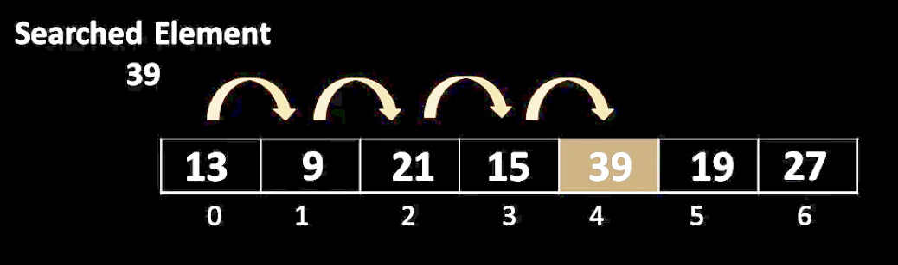
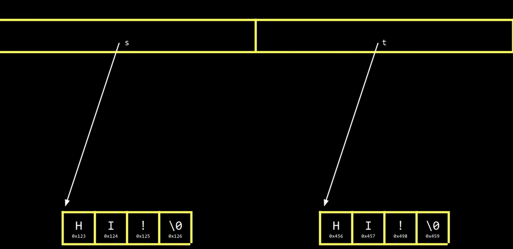

# Lesson 0 - Introduction
***
- On the base hardware level, computers only understand 0s and 1s (binary)

| BINARY | REAL WORLD |
|:------:|:----------:|
|   000  |      0     |
|   001  |      1     |
|   010  |      2     |
|   011  |      3     |

- In real world numbers, we associate each row of a number with a certain value. The number 563 can be deconstructed to 100ths, 10ths, and 1s as: **5x100 + 6x10 + 3x1**
- In **BINARY** you only use 2 to the power

| BINARY | DECONSTRUCTED | OUTPUT  |
|:------:|---------------|---------|
|        |   0x2^2 = 0   |         |
|   010  |   1x2^1 = 2   | 2 = 010 |
|        |   0x0^2 = 0   |         |
|        |               |         |
|        |   0x2^2 = 0   |         |
|   011  |   1x2^1 = 2   | 3 = 011 |
|        |   1x2^0 = 1   |         |

- **ASCII** is short for American Standard Code for Information Interchance. It is a standard as to which sequence of 0s and 1s represent what letter, number, symbol ...

|  **ASCII** |    72    |    73    |    33    |
|:----------:|:--------:|:--------:|:--------:|
| **BINARY** | 01001000 | 01001001 | 00100001 |
| **OUTPUT** |     H    |     I    |     !    |

- 01001000 is **8bits** or **1byte**
- With 8bits, if you choose to include 0, you can only count to 255 (256 if you exclude 0)
- **UNICODE** is a superset onto **ASCII** to allow for not just 8bit character mapping (to keep backward compatability), but also 16bit mapping and therefore allows for **65.000** characters to be mapped.
- An **ALGORITHM** is a set of step by step instructions to solve a specific problem
***
***

# Lesson 1 - C Language
***

|                              **CORRECTNESS**                             |                                                                                **DESIGN & STYLE**                                                                               |
|:------------------------------------------------------------------------:|:-------------------------------------------------------------------------------------------------------------------------------------------------------------------------------:|
| The code must solve the problem at <br>hand and givce a correct solution | Good designed code allows others<br>to understand you code easier, or<br>yourself after some time later.<br>Efficient algorithms are key for<br>nice and clean structured code. |

- **SOURCE CODE -> COMPILER -> MACHINE CODE**
- To inculde a variable in a print statement in C use %  followed by its datatype (i for int, s for string ...). Here %s is the placeholder for the string answer.
```c
printf("hello, %s\n", answer);
```
- On top of every C program, you will find "#include" followed by sime **headerfile**. The headerfile will point the compiler to where all the libraries are stored. Here stdio.h is the standard io library for c
```c
#include <stdio.h>

int main(void)
{
	#your program
}
```
- **DATATYPES in C**

| **BASH COMMAND** |      **DESCRIPTION**      |
|:----------------:|:-------------------------:|
|        cd        |      change directory     |
|       cd ..      |   go to parent directory  |
|        rm        |           remove          |
|       mkdir      | create directory / folder |
|       rmdir      | remove directory / folder |
|        mv        |            move           |

- **FUNCTIONS in CS50.h**

| **printf placeholder** | **Description** |
|:----------------------:|:---------------:|
|           %c           |       char      |
|           %f           |      float      |
|           %i           |       int       |
|           %li          |     long int    |
|           %s           |      string     |

- **OPERATORS in C**

| **Operator** |             **Description**            |
|:------------:|:--------------------------------------:|
|       +      |                addition                |
|       -      |               subtraction              |
|       *      |             multiplication             |
|       /      |                division                |
|       %      | remainder<br>5%2 = 1<br>5/2 = 2 Rest 1 |

- There are three ways to increment a variable by one. Here 1 is added to the variable "counter"
```c
counter = counter + 1;
counter++;
counter += 1;
```
- In C once a variable is declared with a datatype, it does not have to be declared again
```c
int counter = 0;
counter++;        // No further int counter required, only counter
```
- To declare a variable and make it not changeable later on in the code, use const followed by an all caps variable name (all caps not mandatory but convention for C)
```c
const int BASE = 2;
```
- **IF STATEMENT CONDITIONALS**
```c
if (x == 0 || x == 1)        // OR
{
	# code
}

if (x == 0 && x == 1)        // AND
{
	# code
}
```
- **WHILE LOOP IN C**
```c
int i = 0;
while (i < 3)
{
	printf("hello\n");
	i++;
}
```
- **DO WHILE LOOP IN C**
```c
do
{
	// code goes here
}
while (n < 1);
```
A while loop checks the condition **BEFORE** executing the code. A do-while loop first executes the code at least once, then checks the condition and if the conditon is true, goes to execute the code again.
- **FOR LOOP IN C
```c
for (int i = 0; i < 3; i++)
{
	printf("hello\n");
}
// for (variable; condition; update)
```
- **CREATE A FUNCTION IN C**
The first void means, that this function will not return any value or variable, hence void. The second (void) means, that this function will not take any arguments (externally passed variables). A function must be declared prior to being called, this is being called a prototype function (here void hello(void); ).
```c
#include <stdio.h>

void hello(void);             // 2nd.: this makes the function callable

int main(void)
{
	void hello(void)         // 1st.: create the function
	{
		printf("hello\n");
	}
	hello();                 // 3rd.: call the function
}
```
- **FLOATING POINT INPRECISION**
The computers inability to represent all possible real numbers, since memory is finite and real numbers aren't
***
***
# Lesson 2 - Arrays
***
### COMPILER
- We used the make command to compile hello.c to an executable. But make is not a compiler, but rather a helper to look for the right compiler and create an executable called hello
- For C you could compile the code yourself by
```bash
clang hello.c
```
- This would get a.out, which is an assembly file. You can still run it with
```bash
./ a.out
```
- a.out is the standard name clang (the c compiler) will call the executable. To specify your own name for the clang compiled executable you have to use the flag -o
```bash
clang -o hello hello.c
// compiler flag name sourcecode
```
- This only works if ony stdio.h is used. Every other headerfile (for example cs50.h) in our code, has to be manually linked for the compiler
```bash
clang -o hello hello.c -l cs50
```
- Whenever you use the make command, referred to as compiling, there are actually four things happening
	- **1. PREPROCESSING**
		All headerfiles included in your code have a # infront of them. This is known as "preprocessor directives". This tells the compiler to the those headerfiles and include them above your code, so any function out of these headerfiles can be used in your code
	- **2. COMPILING**
		Turns your C language code from top to bottom into assembly code. This is a very low level language, the computer can understand natively. Those assembly instructions (add, divide, move to memory, read from memory...) are baked into every CPU
	- **3. ASSEMBLING**
		The assembly code, generated from your high level language is now converted into binary code
	- **4. LINKING**
		Now the binary from your sourcecode is combined with the headfiles that are referenced with their respective c files

### DEBUGGING
- printf is a valuable tool to check your variables or functions to see what they do or how they behave in case you have to debug the code
- You can use **debug50** on your code to step through your code from a breakpoint and see line for line, what your code is doing and how your variables change
```bash
debug50 ./test
```

### TYPES
- We already saw some datatypes like bool / char / int / float ....
- Whenever one expression of an arithmatic is a float, all expressions of that arithmatic will be treated as a float
```c
int x = 4;
int y = 5;
float sum = x + y
// sum will now be 9.0
```

### ARRAY
- Is another datatype, that allows you to store multiple values, of the same type (int, float, char ..) back to back
```c
// create each variable on its own
int score1;
int score2;
int score3;

// create array
int scores[3];
```
- To add the scores to the array, you add them, starting at index 0
```c
scores[0] = 72;
scores[1] = 73;
scores[2] = 33;
```
- Note no further int declaration is needed, since the array was initialized as array of ints
- In C a string is nothing more than an array of chars
- In memory a nul character defines the end of a string. A nul character is written in shorthand as  \ 0  which is nothing but 8x0. So every string takes up 1 byte per character + 1 byte for the nul character to depict its end

### Note
- C can print the ASCII value of a char
```c
char c1 = 'H';
char c2 = 'I';
char c3 = '!';

printf("%c %c %c", c1, c2, c3);

// this prints HI!
```
- But if you print these chars as int, the ASCII code of each char is printed
```c
printf("%i %i %i", c1, c2, c3);

// this prints 72 73 33
```
- Another way is **implicit type casting**. This will also print 72 73 33 but here we implicitly tell it to print the ASCII value and not rely on C to make it automatically
```c
printf("%i %i %i", (int)c1, (int)c2, (int)c3);
```
- string.h includes a function called strlen which returns the length of a given string
```c
int length = strlen(name);
```
- In ASCII every letter corresponds to an integer value. Capital letters first, then Lower case letters. Since C can also use the ASCII value for a char, we can turn letters to upper case or lower case, by manipulating their ASCII value
	=> Captial to Lower = + 32
	=> Lower to Capital = - 32
- Inside a boolean expression, if the return value = 0 it is seen as false
	=> simple arithmatic can act as true / false expression

### COMMAND LINE ARGUMENTS
```c
int main(void)
{
	// code
}
```
- The (void) means our program does **not** take command line arguments
- Command line arguments are passed to the main, after typing them behind the program execution in the command line
```bash
./program arg1 arg 2
```
- The standard arguments that are passed to main are **argc** and **argv[]**. While argc stand for argument count and argv is an array of words called argument vector
```c
int main(int argc, string argv[])
{
	// code
}
```
- argc is always atleast 1 because the first argument counted for is the program name
```bash
./program Thomas
```
```c
int main(int argc, string argv[])
{
	if (argc > 1)
	{
		printf("hello, %s\n", argv[1]);   //index 0 would be program namne
	}
	else
	{
		printf("hello word\n");
	}
}

// this prints hello, thomas
```

### EXIT STATUS
```c
int main(int argc, string argv[])
{
	if (argc != 2)
	{
		printf("Missing user input\n");
		return 1;
	}
}
```
- Whenever you break out of your programm by design (for example required input by user was not given), have main return a non 0 value, by convention use 1
- By default, if defined or not, C will return 0 to let the computer know, your programm worked fine
***
***

# Lesson 3 - Algorithms
***
- The efficiency of code or algorithms is measured in **running time**. How much time does the code / algorithm take to make the neccessary steps. The measure for this is **big O notation**


- The bigger the problem size becomes, the more similar O(n) and O(n/2) will look and only O(log2n) will stand out
- Convention is, to just refer to O(log2n) as O(logn)
- A for loop that runs n times, big O will be O(n)
- Examples for real world big O notation running times are:
	- O(n^2)
	- O(n log n)
	- O(n)
	- O(logn)
	- O(1)
- Big Ω (omega) is used to describe the lower bound of an algorithm or how few steps an algorithm might take. Big O is the upper bound, on how many steps an algorithm might take.
	- Ω(n^2)
	- Ω(n log n)
	- Ω(n)
	- Ω(logn)
	- Ω(1)
- Big Θ (theta) is used when the upper and lower bound of an algorithm running time is equal
	- Θ(n^2)
	- Θ(n log n)
	- Θ(n)
	- Θ(logn)
	- Θ(1)

| **NOTATION** |               **DESCRIPTION**              |
|:------------:|:------------------------------------------:|
|       O      |        upper bound (how many steps)        |
|       Ω      |         lower bound (how few steps)        |
|       Θ      | O = Ω (upper and lower bound are the same) |

- The input n into these expressions, is the number of steps for the algorithm to complete. Smaller means faster

|  **2** |       | **100** |       | **10.000** |
|:------:|:-----:|:-------:|:-----:|:----------:|
| log(n) | **<** |   (n)   | **<** |    (n^2)   |


### LINEAR SEARCH

```c
int main (void)
{
	int numbers[] = {4, 6, 8, 2, 7, 5, 0}
	for (int i = 0; i < 7; i++) //array length -1 is 7 beacause we count from 0
	{
		if (number == 0)
		{
			printf("Found\n");
			return 0;
		}
	}
	printf("Not found\n");
	return 1;
}
```
- **O(n)** because max number of loops is n times
- **Ω(1)** because number could be found at array index 0 and therefore run only once

### BINARY SEARCH

- Prerequisit is, that the array is sorted from small to big
```c
// Pseudo Code
// If nothing in array
//    return false
// If number at middle of array
//    return true
// Else if number < number[middle of array]
//    search array[0] through array[middle - 1]
// Else if number > number[middle of array]
//    search array[middle + 1] through array[arrayLength - 1]
```

-  **O(logn)** because you half the problem with every step until you find the target
-  **Ω(1)** because the first index of the array may be the number you looked for

### DATA STRUCTURES
- In C we have the ability to invent our own datatypes
```c
type def struct    //tells the compiler it is a structure
{
	string name;
	string number;
}
person;            // name of datatype

person people[2];  // new array of type person and size 2
people[0].name = "Thomas"
people[0].number = "09953-2211"
```
- This way we encapsulate all information for one person into one datatype
- This **is not a class or object** because this does not have the ability to also contain functions and C is not an object oriented programming language

### SELECTION SORT

```c
// Pseudo Code
// For i from 0 to n-1
//    Find smallest num between num[i] and num[i-1]
//    Swap smallest num with num [i]
```


-  **O(n^2)** The steps are actually layed out as n + n(-1) + n(n-2) ... and since n^2/2 has the highest impact on this equation, we just consider n^2
-  **Ω(n^2)** Even if the array was already sorted, it would iterate through n times and make sure all integers are in order so n + n(-1) + n(n-2) ....
- **Θ(n^2)** Because best case scenario (array is sorted) and worst case (array not sorted) take the same time O = Ω = Θ

### BUBBLE SORT

```c
// Pseudo Code
// Repeat arrayLength - 1 times
//   For i from 0 to arrayLength -2 (because last array index has no i+1 pos)
//      If num[i] and num[i+1] not in order
//         Swap num[i] with num[i+1]
//      If no swaps
//         quit
```
- The reason to do this n-1 times and not just the inner loop, is that during each O -> n-2, the swap moves the digits only one position. If 0 was at the end, it would only move the whole array one to the left

- **O(n^2)** You have two loops so you multiply outer loop x inner loop, that is (n-1) x (n-2) = n^2 - 1n - 1n + 3 ... since only n^2 is very big, it is deemed the biggest impact and the rest of it is dropped
-  **Ω(n)** In the best case scenario (array is sorted), Bubble sort has only one pass to make and quits if no swaps are made

### MERGE SORT

- Merge Sort divides the problem in half and then merges the results of the sorted halfs
```c
// Pseudo Code

// If only one number
//    quit
// Else
//    Sort left half of array
//    Sort right half of array
//    Merge sorted halfes
```
- You end up with to sorted halfes (lists) and look at the first position of each half. The smaller digit at this comparison is then transfered to the sorted list

- **O(n log n)**
- **Ω(n log n)**
- **Θ(n log n)**


### RECURSION


- Recursion is a programming technique, whereby a function calls itslef
- An example would be our mario.c program that drew the blocks
```c
// Mario.c regular way
#include <cs50.h>
#include <stdio.h>

void draw(int n);     // prototype for our own draw function

int main(void)
{
	int height = get_int("Height: ");
	draw(height);
}

void draw(int n)      // draw function
{
	for (int i = 0; i < n; i++)
	{
		for (int j = 0; j < i+1; j++)
		{
			printf("#");
		}
		printf("\n");
	}
}
```
- And here the same program with recursion
```c
#include <cs50.h>
#include <stdio.h>

void draw(int n);     // prototype for our own draw function

int main(void)
{
	int height = get_int("Height: ");
	draw(height);
}

void draw(int n)
{
	if (n <= 0)     // Base case, a way to exit and avoid infinite loop
	{
		return;
	}
	draw(n-1);

	for (int i = 0; i < n; i++)
	{
		printf("#");
	}
	printf("\n");
}
```
***
***
# Lesson 4 - Memory
***
### HEXADECIMAL SYSTEM
- RGB Values are usually displayed as an amount of RedGreenBlue and are worked with in the hexadecimal system

| **RED** | **GREEN** | **BLUE** |    **COLOR**    |
|:-------:|:---------:|:--------:|:---------------:|
|    FF   |     00    |    00    |  #FF0000 = RED  |
|    00   |     FF    |    00    | #00FF00 = GREEN |
|    00   |     00    |    FF    |  #0000FF = BLUE |
|    FF   |     FF    |    FF    | #FFFFFF = WHITE |
|    00   |     00    |    00    | #000000 = BLACK |

- There are the following systems:
	- Binary = 01
	- Decimal = 01233456789
	- Hexadecimal = 0123456789ABCDEF


- So you can construct different numbers since the hexadecimal system is base16. That means the first position is 16^0, the second 16^1 ...
	- 0 = 00 = (16 x 0) + (1 x 0)
	- 9 = 09 = (16 x 0) + (1 x 9)
	- 15 = 0F = (16 x 0) + (1 x 15)
	- 16 = 10 = (16 x 1) + (1 x 0)
	- 174 = AE = (16 x 10) + (1 x 14)
	- 255 = FF = (16 x 15) + (1 x 15)
- This allows to count to 255 with using only 50% of the digits in hexadecimal, compared to decimal, thus using less memory
- 255 in binary is 11111111 so FF represents 1111 for each F meaning hexadecimal treats data in units of 4bits
- RAM Memory location is counted in hexadecimal but to not confuse the number with a decimal, the **convention is to count 0x0, 0x1 ... 0xF** instead of 0, 1 .. 15

### POINTERS
```c
#include <stdio.h>

// assign the value 50 to the variable n
int main(void)
{
	int n = 50;
	printf("%i\n", n);
}

// This will print 50
```
- An integer uses 4bytes, so somewhere in memory 4bytes are used to store the integer 50
- A Pointer is the variable that stores the memory adress of some value
```c
int *p = &n;
```
- Here & is an operator for "adress of". If you use this, c will figure out what the memory adress of that variable is
- To store that adress not as an int but as the memory adress you have to store it in a variable with a preceeding * to let C know, that you are not storing an integer in this variable but the adress of something
- So you first declare the data type, of which you want to store the memory adress (int, float, char) to a pointer variable (using the asterix) and then you use & to get the adress of said variable
```c
#include <stdio.h>

// no we assign 50 to n and then get the adress and print the memory location
int main(void)
{
	int n = 50;
	int *p = &n;
	printf("%p\n", p);
}
```
- This will print 0x7ffcb4578e5c
- Note we are not using %i to print the content of the pointer but %p
- You can print this without declaring a pointer first as well
```c
int main(void)
{
	int n = 50;
	printf("%p\n", &n);
}
```
- This would also print 0x7ffcb4578e5c
- As with previous variable declarations, once the variable is declared, you no longer have to use int in front of or use the asterix
- When you want to see what a certain memory location has stored, and not just look where a certain variable is stored
```c
int main(void)
{
	int n = 50;
	int *p = &n;
	printf("%p\n", p);      // get the adress of int n
	printf("%i\n", *p);     // Look up what int is stored at memory adress p
}
```
- This will print 0x7ffcb4578e5c and then 50, which is the integer that was stored at this memory adress
- Note to look up what is at a certain memory location we again have to use the asterix prior p (called dereferencing the pointer)
- A pointer is always taking up **8bytes in memory (64bits)**, because todays memory is big enough, so an adress takes up to 8bytes to represent

### STRINGS IN C
- Until no we used the <cs50.h> library to get the data type string
```c
string s = "Hi!";

// This is as an array of chars as:
// H i ! \0
// The \0 (null) just representing the end of the array
```
- So since this string is an array of characters (chars) it it stored in sequence next to each other in memory
- But this array is stored as variable s of type string, which does not exist in C. So cs50.h created the data type string and a variable of type string is nothing but a **pointer**, pointing at the memory location, where the first element of the array of chars is stored. The end is depicted by the null character
```c
#include <cs50.h>
#include <stdio.h>

int main(void)
{
	string s = "Hi!";
	printf("%s\n", s);
}

// prints Hi!

int main(void)
{
	char *s = "Hi!";           // cs50.h gave us string data type, but C does not have such a data type. C uses char *s
	printf("%s\n", s);
}

// prints Hi!

int main(void)
{
	string s = "Hi!";
	char *p = &s[0];      // &s is an operator. &s[0] is the memory adress of s[0]
	printf("%p\n", p);    // print memory location of first character of string s
	printf("%p\n", s);    // print memory location of string s
}

// prints 0x7ffcb4578e5c
//        0x7ffcb4578e5c
```
- Since both memory locations are the same, we can see that underlying string is just an array of chars
- The printf function uses the %s (for string), although C does not have a string data type, and just starts printing all characters starting from memory location of s, until it hits the null character
```c
typedef char *string;
```
- This is all there has been in cs50.c to get string datatype

### POINTER ARITHMETIC

- The doube quotes are a special for strings. It lets the compiler know that is not just a character, but a string and automatically stores the sting in memory and adds the null character at the end 
```c
#include <stdio.h>

int main(void)
{
	char *s = "Hi!"
	printf("%c\n", s[0]);
	printf("%c\n", s[1]);
	printf("%c\n", s[2]);
}
// H
// i
// !
```
- Here we used [0] to indicate we want to print the first character of the string. But char star is basically just the adress of the first character of the string.
```c
#include <stdio.h>

int main(void)
{
	char *s = "Hi!"
	printf("%c\n", *s);
	printf("%c\n", *(s + 1));
	printf("%c\n", *(s + 2));
}
// H
// i
// !
```
- Since char star points to the adress of the first character only, we can add a byte (here + 1) to it to get the next character of the string.
- But convention is to use the s[0] syntax, because it makes the code more readable
```c
#include <stdio.h>

int main(void)
{
	int numbers[] = {4, 6, 8, 2, 7 ,5 ,0};
	printf("%i\n", *numbers);
	printf("%i\n", *(numbers + 1));
	printf("%i\n", *(numbers + 2));
}
// 4
// 6
// 8
```
- The interessting thing here is, that an int is usually 4 bytes (32bits) long, yet I do not have to add 4, 8, 12, 16 to get the next stored int. The compiler will automatically do this, so + 1 here means next memory location or new int. This works for all data types, since we declare the data type beforehand (here for the array), so the compiler knows how many bytes it needs to shift the memory location, to get the next item
- Note here, that we did not have any star operator, when we declared the array. this is because an array basically only points to its first item. Yet different to strings, there is no null at the end of the array!
```c
#include <cs50.h>
#include <stdio.h>

int main(void)
{
	char *s = get_string("s: ");
	char *t = get_string("t: ");

	if (s == t);
	{
		printf("same");
	}
	else
	{
		printf("different");
	}
}

// The output will always be different
```
- The reason why you cannot compare two strings with each other and expect to get them to assess equal (hi == hi), but always come out as false, is the fact, that char star only points to a memory adress, and those will never be the same, for two different strings (even though they have the same characters)


### DYNAMIC MEMORY ALLOCATION

```c
#include <cs50.h>
#include <string.h>
#include <stdio.h>
#include <ctype.h>

int main(void)
{
	string s = get_string("s: ");    // example input will be hi!
	string t = s;

	t[0] = toupper(t[0]);

	printf("%s\n", s);
	printf("%s\n", t);
}

// Hi!
// Hi!
```
- we created a string with user input, and then copied this string to the variable t. We used toupper function (from ctype.h) to make the first letter of t upper case, yet this seemed to have changed the first letter of s to upper case as well. The reason is, when we declared string t = s, we literally copied the adress of the first character of s, to t. So when we then used toupper, we used it on the first character at that adress, which is linked to both s and t
- For memory allocation we use to functions:
	- malloc = memory allocation, we pass how much memory we need, malloc will find the amount and pass you the adress of the first free byte of that requested free space
	- free = clears the memory, previously allocated by malloc for our use, and makes it available to the computer again

```c
#include <cs50.h>
#include <string.h>
#include <stdio.h>
#include <ctype.h>
#include <stdlib.h>

int main(void)
{
	char *s = get_string("s: ");    // example input will be hi!
	
	char *t = malloc(strlen(s) + 1); // the null character has to be accounted for manually!!
	
	if (t == NULL)   // A possible check if malloc assigned memory, otherwise terminate program
	{
		printf("No memory could be allocated");
		return 1;    // program will quit
	}

	strcpy(t, s);    // strcpy (from stdlib.h) copies a string, first argument is the new string, second the source string

	if (strlen(t) > 0)  // check if string is not empty, to avoid error
	{
		t[0] = toupper(t[0]);
	}

	printf("%s\n", s);
	printf("%s\n", t);

	free(t);     // free the memory allocated by malloc up again. Only required for malloc assigned memory
}

// hi!
// Hi!
```
- no we got some free memory from the function malloc, we assigned the free memory to the variable t and the copied the string s with strcpy into the new memory location. Whatever we do to the string assigned to t, will not change the string s because they are now at two different memory locations
- NULL is to check if a pointer is valid or not. If malloc fails to allocate memory, it will return NULL, therefore, if we check if t == NULL, this would indicate, that no memory was allocated by malloc
```c
#include <stdio.h>
#include <stdlib.h>

int main(void)
{
	int *x = malloc(3 * sizeof(int));
}
```
- Since int may have different size in bytes on different systems, we can use sizeof() do have the system determine what the sice of one int in memory will be and just multiply this by the amount of ints we want to store
- Here we assign the returned memory adress, enough for 3 ints, to the pointer x
- In this example we asked for enough memory to store 3 ints. If we assign 4 or more ints, we cause a buffer-overflow. We demand more memory than previously reserverd for us. Depending on the amount of excess, the program may crash or not. The program will still compile ok, but may crash on execution with a segmentation fault
- To check a program for memory issues you can run it with valgrind
```bash
valgrind ./program
```
- valgrind will find memory related issues with you code

### GARBAGE VALUES
- If you initialize an array, for example of ints, and you do not assign values to it right away, later in the code, when you access this array (without any values assigned to it), there might still be values showing up. This could be garbage values, data left in memory by some other program, that is now showing up in your program

### STACK OVERFLOW


- You local variables and functions are stored in the stack. All malloc memory allocations happen in the heap. So the more memory you use by calling malloc and the more local variables and functions you use, the closer they get and you might run out of memory and cause a stack overflow

```c
int main(void)
{
	int x = 1;
	int y = 2;

	swap(x, y);
}

void swap(int a, int b)
{
	int tmp = a;
	a = b;
	b = tmp;
}

// a and b will be swapped, but x and y remain the same
```
- This small should swap the value of a with b, but it does not return anything back to main and leaves the tmp variable in memory, filling up the stack
```c
int main(void)
{
	int x = 1;
	int y = 2;

	swap(&x, &y);  //We use the "adress of" operator & and only pass the adress where the int is stored to the swap
}

void swap(int *a, int *b)
{
	int tmp = *a;
	*a = *b;
	*b = tmp;
}

// Now swap swapped the values to the memory adresses of x and y, so main will look at this adress and find that x = 2 and y = 1
```
- Here we do not pass variables with their values into the swap function, but the pointers to the memory where the value is stored. With this, we use what is already in memory, change it over to each other and have the effect, that we do not have to return anything and the swap happend in memory, so it will be useable in main aswell
***
***
# Lesson 5 - Data Structures
***
- Until now we used arrays to store a defined number of elements (like ints) and gave it a finite amount of memory to store our values. If we wanted to add to that array, we might run into the issue that at the end of the array in memory there could be some other used data. That means we cannot extend the array at that memory location. Instead we would have to copy the array to a free memory location that gives us enough space to add our new elements.
- This results in first copying the existing array to that new memory location, giving us a runtime of O(n), because we have to itterate over every element to copy the arrays content to the new location.
- If we then wanted to add a new element to our sorted array, and the element would have to be somewhere inside the array (and not the beginning or the end), we have to first utilise a search algorithm to find the spot, where we want to copy the new item. That results in a runtime of O(log n).
```c
// Classic way to create a list of three elements (memory comes from stack)

#include <stdio.h>

int main(void)
{
	int list[3];
	list[0] = 1;
	list[1] = 2;
	list[2] = 3;

	for (int i = 0; i < 3; i++)
	{
		printf("%i\n", list[i]);
	}
}


// Create the same list with dynamic memory allocation (memory comes from heap)

#include <stdio.h>
#include <stdlib.h>

int main(void)
{
	// dynamically allocate an array of size 3
	int *list = malloc(3 * sizeof(int));
	
	// check if memory allocated, if not quit
	if (list == NULL)
	{
		printf("No memory allocated\n");
		return 1;
	}
	// Assign 3 numbers to that array
	list[0] = 1;
	list[1] = 2;
	list[2] = 3;

	// Resize array to fit 4 numbers
	int *tmp = realloc(list, 4 * sizeof(int));

	// check if memory allocated, if not quit
	if (list == NULL)
	{
		printf("No memory allocated\n");
		return 1;
	}
	
	// Add 4th number to new array
	list[3] = 4;

	// free memory of new array
	free(list);
	return 0;
}
```
- realloc will grow an existing array to fit defined new number of items. If the memory allocated to the original array can not be grown larger, because the memory right after is already full, it will automatically assign a new memory space of specified size and will copy the contents of the original memory to the new memory location for you

***
### SHORT REVIEW

struct
A keyword in C that lets you invent your own structure, your own variable in conjunction with typedef, allowing you to constract a "person" for example that hast a Name, Age ... You encapsulate multiple data
```c
typedef struct    //tells the compiler it is a structure
{
	string name;
	string number;
}
person;            // name of datatype

person people[2];  // new array of type person and size 2
people[0].name = "Thomas"
people[0].number = "09953-2211"
```

.
The dot notation allows you to access a field inside a struct. As seen above, we can access the person name by person[0].name

*
We have seen it to declare a pointer. For example as int * age. Or it was used as the dereference operator We used it without an int or anything infront so by using just * age we go to the address of that variable.

***
### Linked List
- to avoid to move the contents of an array or list everytime the adjacent memory is not free, so we cannot add more to the list unless moving the existing list to a new memory location, we can use a linked list. Here we just point to the location of the content, which may exist anywhere in memory and does not have to be adjacent to each other


- Each item in the list points to its next item. The items do not have to be next to each other in memory, that is way for every item we save in the list, we also save the memory address of the next item. For the last item we just store 0x0 or NULL to indicate the end of the list
- Since each of the stored items encapsulates more information (the memory address of the next item), we can refer to each item as NODE
- To construct the node as our datatype:
```c
typedef struct node
{
	int number;
	struct node *next;
}
node;

// Since we are using node in the struct before we declare it, we have to write the code in the way as shown above. We predeclare it with struct node, so the compiler knows about node, before he reads it in the {}. Otherwise the compiler will cause an error (compare to struct person above to see the difference)
```
- To construct a linked list in C you declare a variable list as below, that itself stores the adress of a node, since it only needs the adress of the beginning because every node points to the next one
```c
node *list = NULL;
// here we assign null just to have a known value and avoid having a garbage value showing up
```
- To construct a new node to add to the list, we construct it with malloc
```c
node *n = malloc(sizeof(node));

// if malloc allocated memory, assign number 1 to node (old pointer way)
if (n != NULL)
{
	(*n).number = 1;
	(*n).next = NULL;
}

// if malloc allocated memory, assign number 1 to node (new pointer syntax)
if (n != NULL)
{
	n->number = 1;
	n->next = NULL;
}
```
- The last step is to add the adress of the first node to the list pointer
```c
list = n;
```

- Now we do the same thing we did with the array based list in the beginning, but with a linked list:
```c
#include <stdio.h>
#include <stdlib.h>

// declare the datatype node
typedef struct node
{
	int number;
	struct node *next;
}
node;


// main program
int main(void)
{
	// List of size 0
	node *list = NULL;

	// Create memory for node
	node *n = malloc(sizeof(node));

	// If no memory allocated, quit program
	if (n == NULL)
	{
		return 1;
	}
	
	// assign values to node
	n->number = 1;
	n->next = NULL;

	// Update list to point to first node
	list = n;

	// Add another number to the list (n already delcrared above, so we can reuse it)
	n = malloc(sizeof(node));
	if (n == NULL)
	{
		free(list);
		return 1;
	}

	n->number = 2;
	n->next = NULL;

	// Update list to have the first node to point to second node
	list->next = n;

	// Add a third number to the list (n already delcrared above, so we can reuse it)
	n = malloc(sizeof(node));
	if (n == NULL)
	{
	// here we first have to free node 2, and then node 1, because to access node 2 we need node 1
		free(list->next);
		free(list);
		return 1;
	}

	n->number = 3;
	n->next = NULL;

	// Update second node pointer to third node
	list->next->next = n;


	// To print each number of our linked list, we can no longer use [i] to iterate through the list
	for (node *tmp = list; tmp != NULL; tmp = tmp->next)
	{
		printf("%i\n", temp->number);
	}


	// At the end we have to free all memory assoicated with our linked list
	while (list != NULL)
	{
		// We point at the second node, so we can delete the first
		node *tmp = List->next;
		free(list);
		// Now we have list point at second node, so next loop we can point at 3rd node and delete the 2nd, which is no the 1st
		list = tmp;
	}
	return 0;
}
```


- This means, when we have to look up a value, in worst case we will have a O(n) runtime, because we only see one item at a time. If we want to insert an item and do not care about the list being sorted, we can insert it at the beginning and have a runtime of O(1). But if we want to insert the item at the end it will also have a runtime of O(n)
***
### Binary Search Tree
- instead of laterally linking items together in memory, we could add a second dimension to it called a tree
- In binary search in a sorted array, we could find the middle of the array by doing simple arithmatic (items in array / 2 round to next number). This way we got a left and a right half to perform our search on.

- No given the dynamic memory allocation we can use by now, what if we keep the basic idea of binary search, but utilise nodes to do the search

- So the idea is to create a node, but instead of creating a pointer to next, we will create a pointer to the left and right
```c
typedef struct node
{
	int number;
	node *left;
	node *right;
}
node;
```
- But what is the benefit? Suppose we want to search for the number 3. So the tree begins with the root node, the parent, which is 4 in the picture above. Because it is still sorted, I can assume that if the number I am looking for is smaller than the parent, I have to go left in the tree. The same applies when I reach 2. Since we are looking for 3, it is bigger than 2, so this time I have to look right and there we find 3
- The runtime is O(log n) but the tradeoff is that every number is now represented with a node, containing not just the number, but also two pointers for left and right. As usual you trade time vs memory size
```c
// Implement a list of numbers as binary search tree

#include <stdio.h>
#include <stdlib.h>

// Construct the node
typedef struct node
{
	int number;
	struct node *left;
	struct node *right;
}
node;

// Function Prototypes 
void free_tree(node *root);
void print_tree(node *root);

int main(void)
{
	// Tree of size 0
	node *tree = NULL;

	// Add number to list
	node *n = malloc(sizeof(node));
	if (n == NULL)
	{
		return 1;
	}

	n->number = 2;
	n->left = NULL;
	n->right = NULL;
	tree = n;

	// Add another number to list
	n = malloc(sizeof(node));
	if (n == NULL)
	{
		return 1;
	}

	n->number = 1;
	n->left = NULL;
	n->right = NULL;
	tree->left = n;

	// Add another number to list
	n = malloc(sizeof(node));
	if (n == NULL)
	{
		return 1;
	}

	n->number = 3;
	n->left = NULL;
	n->right = NULL;
	tree->right = n;

	// Print tree
	print_tree(tree);

	// Free tree
	free_tree(tree);
	
}

void print_tree(node *root)
{
	if (root == NULL)
	{
		return;
	}
	print_tree(root->left);
	printf("%i\n", root->number);
	print_tree(root->right);


void free_tree(node *root)
{
	if (root == NULL)
	{
		return;
	}
	free_tree(root->left);
	free_tree(root->right);
	free(root);
}
```
- If you want to implement binary search in a tree you could do it as follows. You input the root of the tree and the number you are looking for, the result will be a boolean
```c
// prototype for a search function in a binary search tree
bool search(node *tree, int number)
{
	if (tree == NULL)
	{
		return false;
	}
	else if (number < tree->number)
	{
		return search(tree->left, number);
	
	else if (number > tree->number)
	{
		return search(tree->right, number);
	}
	else (number == tree->number)
	{
		return true;
	}
```
- A binary search tree has to fullfill following conditons
	- No child to the left of the parent (root) can be bigger than the root
	- No child to the right of the parent (root) can be smaller than the root
- The runtime for a binary search tree is O(log n) if left and right tree are balanced. If you create a tree with only a right side the runtime becomes O(n) because you cannot half the problem into left and right, but have to run through the entire right tree.
***
### Hash Tables
- Hash tables are like the swiss army knife of data structures, since they are so frequently used, because they allow you to use keys associated with values
- A hash table is basically an array, that stores linked lists

- We can construct a hash table with code like this
```c
typedef struct node
{
	// array to store a name. The + 1 is to account for the null character
	char word[LONGEST_WORD + 1];
	struct node *next;
}
node;

node *hashtable[numberOfItems];
```
- Generally we take user input (names, strings, numbers) and have it run through a hash function, where the function determines where the input will be stored (will it be stored alphabetical, by age, by size ....)
- Technically speaking a hash table search will have a runtime of O(n) because depending on your hash table, if you for example sort the names by alphabet and the group of names you are sorting happen to all start with a, you have to traverse the linked list in the a bucket of your hash table, so you are searching in a linked list and therefore have to iterate through all items in the a chain. But in reality hash tables are faster than a singly linked list
***
### Tries [pronounced try]
- Short for retrieval
- A trie is a tree that gives us constant time lookup, even for massive datasets
- You essentially create a tree out of arrays
- An example would be to look at each letter of a name. The root of the tree is an array of every letter of the alphabet. So you take the first letter of the given name and enter the root array, the second letter would than be pointing to a second array and so on ... once the last letter is reached, a boolean may indicate, that we have indeed found a complete name (here green)

- As we can see, some names share a common letter, that means we can save space, compared to storing each name on its own
```c
typedef struct node
{
	bool is_word;
	struct node *children[SIZE_OF_ALPHABET];
}
node;
```
- The runtime of a tries will be O(1), because no matter how many names are stored, you will only have as many steps, as there are letters in the name. So even for a trillion stored names, you will only go 8 steps to find Hermione
***
### Abstract Data Structures
QUEUES
A queues is a data structure that uses FIFO (first in first out) to make sure the queue is done in order. To implement a que you have to implement two functions enqueue and dequeue. To create a queue you could use an array, yet there would be a finite size and elements at some point could no longer join the queue and you would encounter an error. A better solution for this, would be to use a linked list. A growing queue can just add to the linked list and make sure all elements can join the queue. The downside is that the linked list would grow in size and take up more memory.

STACKS
A stack is litteraly things stacked on top of each other (remember recursion) and they follow LIFO (last in first out). This again could be represented by an array or a linked list. The two functions needed for a stack are push (add to stack) and pop(remove from stack). 
***
***
# Lesson 6 - Python
***
- The goal is not to teach you just another programming language, but to teach you how to teach yourself a new language
- We can compare the syntax of C and python with the example of taking an input and then printing the input combined with a string

```c
// Get user input and print input with some string
string answer = get_string("What is your name? ");
printf("Hello %s\n", answer);

// Set counter variable to a value
int counter = 1;

// If statement
if (x > 0)
{
	x++;
}

// While Loop
while (true)
{
	printf("Hello\n");
}
```
```python
# Get user input and print input with some string
answer = input("What is your name? ")
print(f"Hello, {answer}")

# Set counter variable to a value
counter = 1

# If statement
if x > 0:
	x += 1

# While Loop
while True:
	print("hello")
```


- Python is really strict with indentation. It will simply to work if indentations are wrong (white space error)
- Let us quickly look at how to include something in C vs Python

```c
#include <stdio.h>
```
```Python
# Import everything and call it as get_string in your own code (avoid)
import CS50 *

# Import everything and call it as CS50.get_string (good practise)
import CS50

# Import multiple functions but not more than 3 in single line
from CS50 import get_string, get_int, get_float
```

- Compared to a compiled language like C (make program.c) in Python we have a interpreted language. Meaning we do not have to compile our programs but we can use the interpreter python to run our code. The downside to this easier approach is, that interpreted languages are slower than compiled languages

## Exceptions 
- Exceptions are errors like name-error, value-error that can happen, while your python code is running, that are not necessarily detected before you run your code (program asks for int input but gets string)

```Python
try:
	x = int(input("x = "))
except:
	print("Only enter ints!")
	exit()
try:
	y = int(input("y = "))
except:
	print("Only enter ints!")
	exit()

print(x + y)
```

- Traceback error are to be read bottom to top. They show the first called function that failed on the bottom and go back through the stack to show you the resulting followup errors
- Functions built into objects are refered to as methods

- In Python we can also use command line arguments, but not right out of the box, we have to import the argument vector argv

```Python
from sys import argv

if argv == 2:
	print(f"Hello {argv[1]}")
else:
	print("Hello World")

# python argv.py        => Hello World
# python argv.py Thomas => Hello Thomas
```

## Linear Search in Python

```Python
import sys

numbers = [4, 6, 8, 2, 7, 5, 0]

# Linear Search in Python
if 0 in numbers:
	print("Found")
	sys.exit(0)

# Not found case
print("Not found")
sys.exit(1)
```

## Dictionary in Python

```Python

people = {"Carter":"001-033-665-223", "Jeff":"001-345-876-321"}

name = input("Name: ")
if name in people:
	print(f"Number: {people[name]}")
```

## Save data as CSV

```Python
import csv

# opens csv file in append mode to be able to add to it. if opened in w it would overwrite whatever was there
file = open("phonebook.csv", "a")

# ask user for data
name = input("Name: ")
number = input("Number: ")

# create a variable to store writer to csv file
writer = csv.writer(file)

# write a list to the csv file
writer.writerow([name, number])

# close file
file.close()
```

***
***
# Lesson 7 - SQL
***
