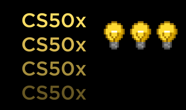

# My CS50 Journey
## Intro
I did some online courses to learn how to code. I started with youtube tutorials on python and managed to create some CLI based programs to do various things.

But at some point I wanted to learn the art of coding from the ground up, understand what happens under the hood and learn this without being initially stuck with one specific programming language.

That's when i discovered CS50X and took on the challenge to complete it and get the certificate.

I am doing the CS50x course while doing my full time job as airline pilot. I figured I could make use of the time I spent in hotels and be productive.
***
## Why this collection?
My goal was to not just to learn everything I can, but be able to review what I learned and have some sort of knowledge database to use for future reference.

So here I will upload all my completed problemsets and my notes, done with Obsidian. There are structured as follows:
- Command Line [How to use the command line]
- Lesson Notes [All notes taken while watching the lecture itself]
- Fundamentals [All CS50 shorts in text form, grouped by topic]
***
## Current Status
Week  0 - Scratch                 [DONE]
Week  1 - C                       [DONE]

Week  2 - Arrays                      [DONE]

Week  3 - Algorithms                  [DONE]
Week  4 - Memory                      [DONE]
Week  5 - Data Structures             [DONE]
Week  6 - Python                      [CURRENT]
Week  7 - SQL                         [TODO]
Week  8 - HTML, CSS, JavaScript       [TODO]
Week  9 - Flask                       [TODO]
Week 10 - Emoji                       [TODO]
***
## Roadmap
- Finish CS50x
- Follow up with another CS50 course (like web development)
- Expand on the Fundamentals for whatever fits a knowledge database
***
## Disclaimer
All the problem sets are solved by me, they may not be pretty or the most efficient way, but they get the job done and may be used in future to go back and improve on the code or write it in a different language.

The content of my lesson notes and fundamentals are all taken from CS50.
